# 실행 토폴로지와 워크플로

이 문서는 이 저장소의 노드 토폴로지와 워크플로를 한자리에서 그린다. 판단의 소유자를 색으로 구분하며
주황은 모델이 정하는 자리, 파랑은 코드가 정하는 자리, 회색은 저장소 밖의 표면이다.

에이전트별 도구·프롬프트·미들웨어의 상세는 [에이전트 실행 구조 문서](src/tracer_agent/worker/agents/README.md)와
그 아래 에이전트별 `README.md`가 갖는다. 이 문서는 그 문서들이 나누어 설명하는 위상을 한 장에 모은다.

경로는 두 뿌리를 기준으로 적는다. `chat/graph.py` 처럼 에이전트 이름으로 시작하는 경로와 `runtime/` 으로 시작하는
경로는 `src/tracer_agent/worker/agents/` 아래이고, `contract/` 로 시작하는 경로는 계약 submodule 아래다.
나머지는 저장소 뿌리에서 시작한다.

## 판단의 경계

LangGraph 를 쓰는 이유는 비결정적 판단과 결정적 판단을 다른 자리에 두기 위해서다. 이 저장소는 그 경계를
네 규칙으로 지킨다.

1. 모델은 구조화된 값만 낸다. `DispatchPlan`·`RecipeDraft`·`CleanupDraft`·`TitleSuggestionDraft` 가 그 값이며
   경로 이름을 모델이 고르지 않는다.
2. 경로는 언제나 코드가 고른다. 팬아웃 여부와 재파견 허용과 검증 뒤 분기는 `graph.py` 의 조건부 간선과
   `runtime/routing.py` 의 판정기가 소유한다.
3. 코드가 지울 수 있는 결함은 수리 사유가 될 수 없다. 중복과 상한 초과와 자리표시자는 정규화가 지우고,
   모델을 다시 부르는 것은 근거가 어긋나거나 수가 모자랄 때뿐이다.
4. 결정적 사실의 정본은 한 곳이다. 예산은 `ExecutionBudget`, 도구의 표면은 계약의 `surface`,
   실패 문구는 계약의 `failures` 가 갖는다.

## 전체 토폴로지

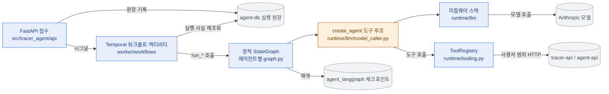

접수는 원장에 사실을 적고 워크플로에 포인터만 보낸다. 워크플로는 그 포인터를 믿지 않고 원장을 다시 조회한다.
체크포인트는 액티비티 재시도가 끝난 노드를 다시 실행하지 않게 하는 자리이며 계약 원장과 결합하지 않는다.

## 노드 토폴로지

### chat

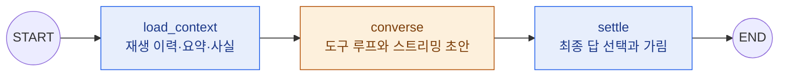

`load_context` 는 연결 계열 오류만 세 번까지 다시 시도하고, `converse` 는 실행 데드라인의 대부분을 상한으로 받는다.
`settle` 은 모델도 도구도 부르지 않고 마지막 어시스턴트 발화와 확인 대기 행만 결과 계약으로 좁힌다.
위상은 `chat/graph.py`, 노드는 `chat/nodes/` 가 갖는다.

### recipe-scan

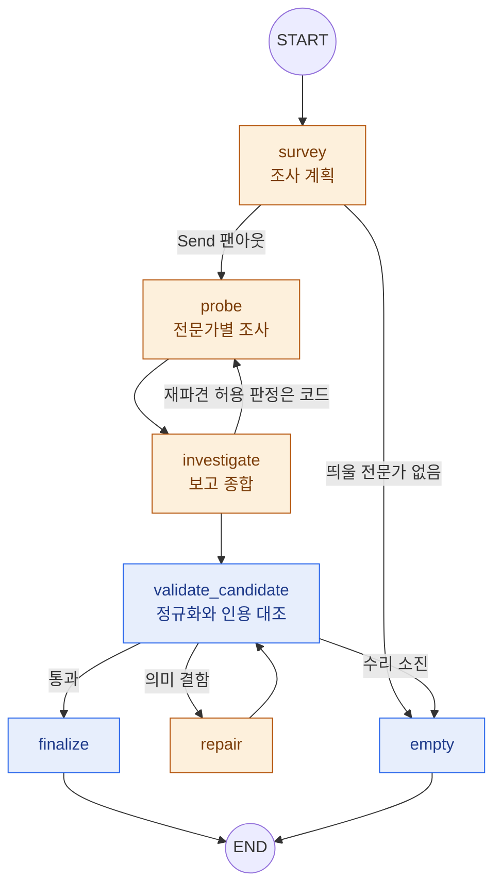

`survey` 와 `investigate` 는 재시도 정책과 시간 상한을 갖고, `survey` 가 끝내 실패하면 오류 처리기가 빈 계획으로
낮춰 결론 없는 성공으로 끝낸다. 전문가에게 나눠 줄 턴과 달러는 `runtime/llm/budget.py` 의 `lease_shares` 가
최대잔여법으로 계산한다. 모델은 몫의 수치가 아니라 계약이 선언한 `shallow`·`normal`·`deep` 중 하나를 고르고,
그 깊이가 받는 몫은 `shared/dispatch_depth.py` 가 계약에서 읽는다. 위상은 `recipe_scan/graph.py` 가 갖는다.

### task-cleanup

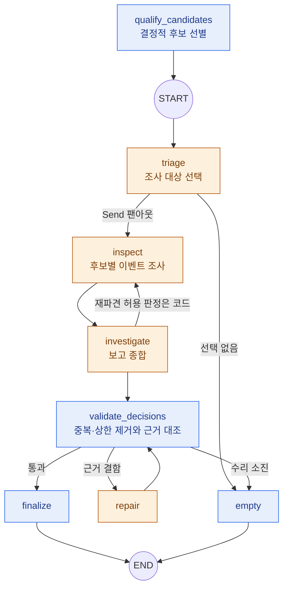

후보는 워크플로가 결정적으로 선별해 실행 입력에 싣고, 모델은 그중 어느 것을 조사할지만 정한다.
분기 판정기는 검증을 통과해도 남은 제안이 없으면 빈 결과로 보내며 그 조건은 `task_cleanup/policy.py` 가 갖는다.
위상은 `task_cleanup/graph.py` 가 갖는다.

### title-suggestion

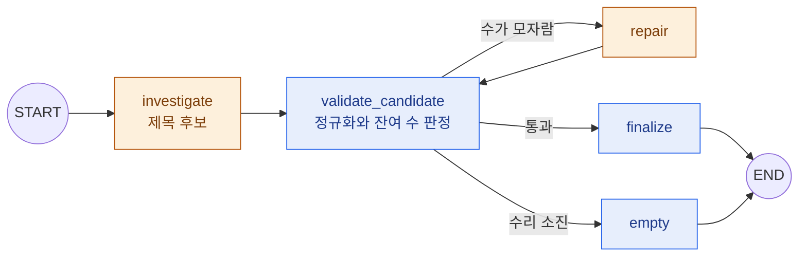

팬아웃이 없는 선형 위상이며 검증 꼬리만 공유한다. 위상은 `title_suggestion/graph.py` 가 갖는다.

## 검증 꼬리

잡 에이전트 셋이 `runtime/validation_graph.py` 의 `add_validation_tail` 로 같은 꼬리를 쓴다. 대화는 검증 분기가
없어 이 꼬리를 붙이지 않는다. 정규화와 검증은 한 노드 안에서 순서대로 실행되고, 수리는 실행 하나에 한 번만 돈다.

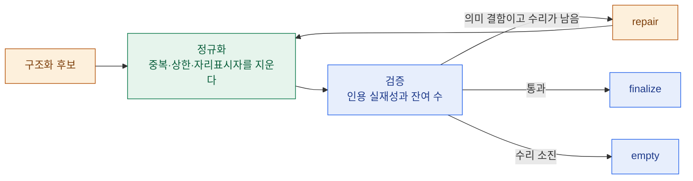

지우기만 하면 되는 결함은 사유를 남기지 않으므로 수리 회차를 쓰지 않는다. 정규화와 검증이 두 구현체에서
같은 판정을 내는지는 계약의 에이전트별 `cases.json` 이 케이스로 고정한다.

꼬리가 쓰는 노드의 기계는 `runtime/validation_nodes.py` 가 갖는다. `ValidationNode` 가 검증 실패를 궤적에
남기는 규칙을 소유하고 에이전트는 판정만 넘기며, `ResultNode` 는 확정과 빈 결과 두 자리에 같은 기계를 세우고
결과를 만드는 규칙만 에이전트에서 받는다. 분기가 궤적에 적는 사유는 `runtime/routing.py` 의
`ValidationReasons` 로 선언하고 그 값은 에이전트별 `policy.py` 가 갖는다.

## 도구 표면

도구가 모델에게 열리는 자리는 계약 한 칸에서만 파생한다. 이름과 인자와 표면의 정본은
`contract/agent/{agent}/tool.json` 이며 이 문서는 그 값을 옮겨 적지 않는다.

| 에이전트 | 표면을 읽는 자리 | 도구를 조립하는 자리 |
| --- | --- | --- |
| chat | `shared/agents/chat/tools/surface.py` | `worker/agents/chat/tools/registry.py` |
| recipe-scan | `worker/agents/recipe_scan/tools/registry.py` | 같은 파일 |
| task-cleanup | `worker/agents/task_cleanup/tools/registry.py` | 같은 파일 |
| title-suggestion | `worker/agents/title_suggestion/tools/registry.py` | 같은 파일 |

chat 은 네 표면(`read`·`agentRead`·`memory`·`confirm`)으로 도구를 가르며 `confirm` 표면의 도구는 실행하지 않고
확인 대기 행만 세운다. 기억을 쓰는 도구도 예외가 아니다. 잡 에이전트는 조사 단계마다 이름 묶음으로 도구를 좁혀
조율 단계가 근거를 직접 캐지 못하게 한다.

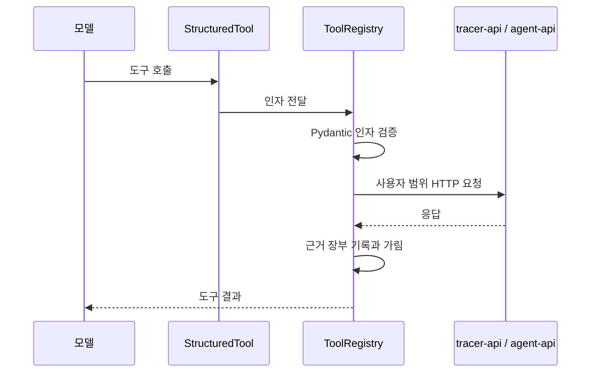

인자가 계약을 어기면 계약이 소유한 실패 문구로 답한다. 그 문구는 `contract/agent/{agent}/tool.json` 의
`failures` 가 갖고 `worker/agents/shared/contract_failures.py` 가 읽는다.

## 프롬프트 구조

시스템 프롬프트는 코드가 소유한 뼈대와 계약이 소유한 조각으로 나뉜다. 턴마다 바뀌는 것은 시스템 자리에 두지 않고
메시지 꼬리에 붙여 캐시 접두사를 지킨다.

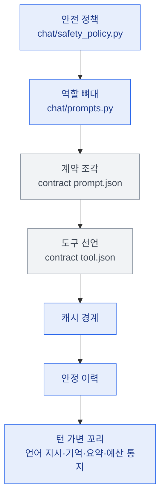

안전 정책은 계약이 아니라 코드가 갖는다. 데이터베이스가 쓴 조각이 정책을 덮지 못하게 하기 위해서다.
꼬리에 붙는 메시지는 `runtime/llm/prompt_cache.py` 가 아는 표시를 달아 캐시 경계가 그 앞에서 멈춘다.

## 미들웨어 스택

목록의 첫 항목이 가장 바깥이며 안쪽으로 갈수록 모델에 가깝다.

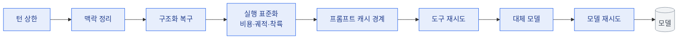

구조화 복구가 실행 표준화보다 바깥에 서므로 스키마에 걸려 버려진 산출도 장부를 지나 예산과 궤적에 남는다.
캐시 경계는 실행 표준화보다 안쪽에 서야 턴마다 바뀌는 꼬리가 붙은 뒤에 그 앞으로 경계를 놓을 수 있다.
스택을 세우는 자리는 `runtime/llm/middleware_stack.py` 의 `AgentMiddlewareStack` 하나이며, 에이전트는 산출 형태와
상한 처리 방식만 정하고 층의 순서를 다시 적지 않는다. 구조화 복구는 구조화 출력을 요구하는 세 잡만 세우고
대화는 자유 텍스트를 내므로 그 층이 없다. 순서 의존과 네 에이전트가 같은 층을 세운다는 사실은
`tests/worker/agents/runtime/test_middleware_order.py` 가 고정한다.

## 예산과 재개

달러와 턴의 장부는 실행마다 하나이고, 그래프 상태는 그 장부의 스냅숏만 싣는다.

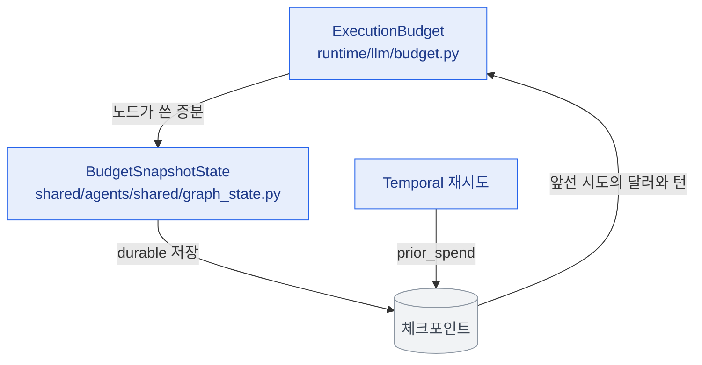

네 에이전트 상태가 `BudgetSnapshotState` 를 함께 상속하므로 두 칸이 언제나 누적으로 합쳐진다. 팬아웃이 몫을
나눌 때 보는 잔량은 `remaining_cost_usd` 와 `remaining_turns` 한 쌍이 계산하며, 넘겨 쓴 실행의 잔량을 0에서
멈추는 규칙도 그 자리에 있다. 상한을 함께 싣는 상태는 `CostCeilingState` 와 `TurnCeilingState` 로 구분한다.
초기 상태는 상태를 선언한 모듈의 `initial_*_state` 가 세우므로 채널이 늘면 그 자리가 함께 갱신된다.
재시도는 앞선 시도의 지출을 안고 시작하므로 상한이 실행 하나에 한 번만 열린다.
예산이 다음 호출을 감당할 수 없으면 실행 표준화가 조사 도구를 거두고 마무리 지시만 남겨 결론을 받는다.
집행은 `ExecutionBudget` 한 곳만 지나며, 루프가 하나뿐인 대화도 `single_loop_budget` 으로 같은 장부를 쓴다.

## 대화 워크플로

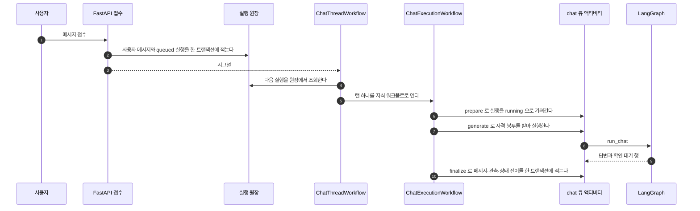

스레드 하나의 턴은 직렬로 실행된다. 시그널은 줄이 움직였다는 포인터일 뿐이고 실행의 사실은 원장에서 다시 조회한다.
쓰기 도구는 모델 턴 안에서 실행되지 않으며, 사용자가 승인하면 창구가 먼저 실행하고 성공한 경우에만 상태를 옮긴다.
그 결과는 tool 메시지가 되어 다음 턴의 재생 이력에 실린다. 워크플로는 `worker/workflows/chat_workflows.py`,
액티비티는 `chat_activities.py` 가 갖는다.

## 잡 워크플로

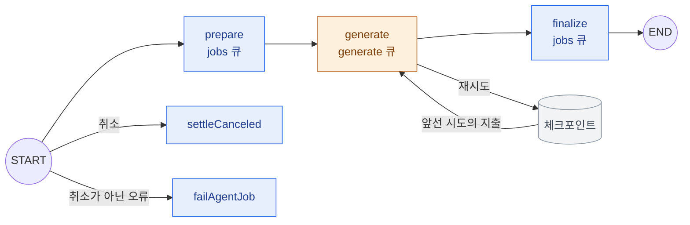

세 잡 종류가 워크플로 하나를 함께 쓰고 단계마다 자기 액티비티와 자기 큐를 갖는다. 준비는 도메인 문맥만 모으고
자격은 생성 액티비티가 실행 직전에 봉투로 받는다. 준비의 산출이 워크플로 이력에 남으므로 자격을 그 자리에 싣지 않는다.
단계별 큐와 시간 상한과 재시도 상한은 계약의 `workflow/queues.yaml` 이 갖는다.
워크플로는 `worker/workflows/jobs_workflows.py`, 액티비티는 `jobs_activities.py` 가 갖는다.

## 오류의 갈래

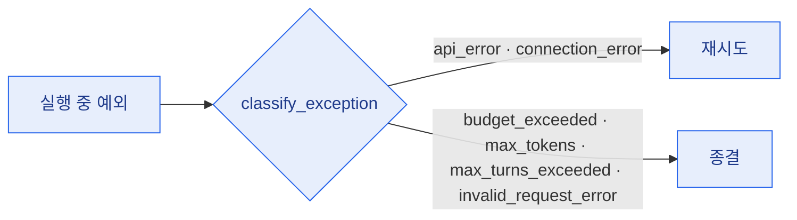

무엇을 다시 시도할 수 있는지는 계약의 어휘로 판정하며 그 판정은 `runtime/errors.py` 가 갖는다.
같은 판정을 LangGraph 노드의 재시도 정책과 Temporal 액티비티의 재시도가 함께 쓴다.
