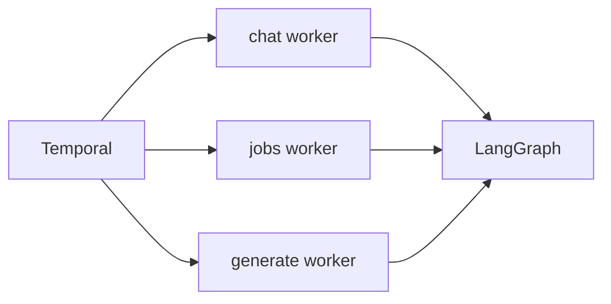
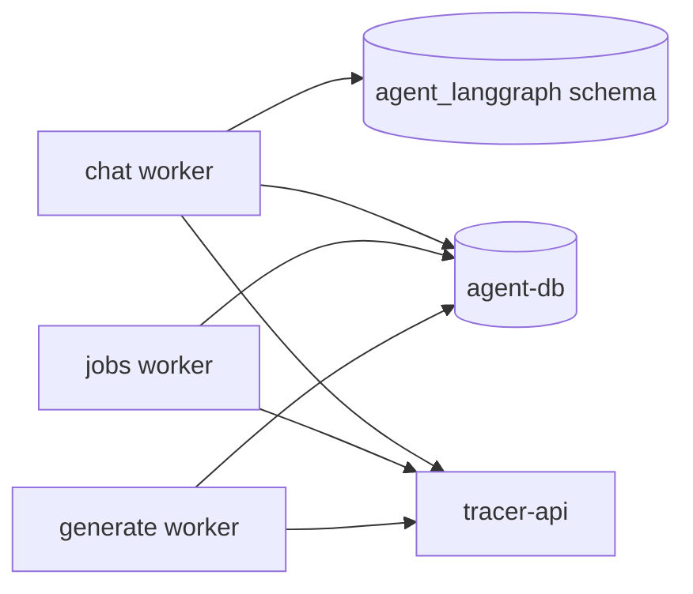

# tracer-agent-python

에이전트 서비스의 Python 구현입니다. FastAPI가 대화와 잡의 접수와 조회와 취소와 스트림을 제공하고, Temporal 워커가 chat·jobs·generate 큐를 각각 소비해 에이전트를 실행합니다. 실행 원장과 레시피·정리 제안 원장은 이 서비스가 소유하며, 실행에 필요한 추적 기록만 추적 API를 HTTP로 읽고 잡의 산출물은 자기 원장에 직접 적습니다.

같은 계약을 만족하는 TypeScript 구현이 따로 있고 배포에서 어느 이미지를 올리느냐로 둘 중 하나가 선택됩니다. TypeScript 구현이 계약의 정본이며, 두 구현체 사이에 지금 남아 있는 차이는 계약 저장소의 `conformance/cases/divergence.json`이 갖습니다. 계약을 함께 만족한다는 사실이 모든 동작이 같다는 뜻은 아닙니다.

## 기능

- LangGraph와 LangChain 기반 대화 실행과 체크포인트
- Temporal 기반 chat·jobs·generate 워커 분리
- chat, recipe scan, task cleanup, title suggestion 에이전트
- 대화 도구 확인·재생·장기기억 API
- 잡 접수·취소·이력·단계 조회 API
- 레시피와 정리 제안 원장의 조회·해소 API와 `recipes` 검색 색인
- 자격 증명이 답과 초안과 도구 결과로 새지 않도록 가리는 절차
- 설정 표면
- OpenTelemetry와 선택적 LangSmith 연동

## 아키텍처

```mermaid
flowchart LR
    Client[Client / agent-web] --> API[FastAPI :8800]
    API --> AgentDB[(agent-db)]
    API --> Temporal[(Temporal)]
    API --> Kafka[(Redpanda)]
    API --> Search[(OpenSearch recipes)]
```



### 워커와 LangGraph 실행



### 체크포인트와 추적 연동



| 구성 요소 | 책임과 경계 |
| --- | --- |
| FastAPI | 계약의 에이전트 API 경로와 `/health`, `/health/ready`, `/internal/surface`를 제공합니다 |
| chat 워커 | 대화 턴의 단계와 체크포인트, 대화 복구를 처리합니다 |
| jobs 워커 | 짧은 잡 액티비티와 상태 정산을 처리합니다 |
| generate 워커 | 모델을 호출하는 긴 액티비티를 분리해 처리합니다 |
| `agent-db` | 이 서비스가 소유하는 실행 원장과 레시피·정리 제안 원장입니다 |
| `recipes` 색인 | 이 서비스가 소유하는 OpenSearch 색인이며 아웃박스 배출기가 채웁니다 |

LangGraph 체크포인트는 `agent_langgraph` 스키마에 두고 계약이 소유하는 원장 표와 분리합니다. 추적 데이터베이스를 직접 읽지 않으며 OpenSearch는 이 서비스가 소유하는 `recipes` 색인만 씁니다.

## 요구 사항

- Python 3.12 (`.python-version`)와 uv
- PostgreSQL 17 계열의 agent database
- Kafka 호환 브로커 또는 Redpanda
- Temporal Server
- Anthropic API 자격 증명
- 실행 중인 `tracer-api` 또는 게이트웨이
- `contract` submodule

## 설치와 실행

```bash
git clone --recurse-submodules https://github.com/agent-tracer/tracer-agent-python.git
cd tracer-agent-python

uv sync --frozen --extra dev
# 이미 clone 한 경우
git submodule update --init --recursive

# agent-db 스키마 적용 — 계약의 DDL 을 Flyway 가 적용하며 도커를 요구한다
docker run --rm -v "$PWD/contract/db/migrations:/flyway/sql:ro" \
  -e FLYWAY_URL=jdbc:postgresql://host.docker.internal:5434/agent \
  -e FLYWAY_USER=root -e FLYWAY_PASSWORD=root \
  flyway/flyway:11-alpine migrate

# API 서버
uv run tracer-agent

# 워커 세 프로세스를 각각 실행
uv run tracer-agent-worker chat
uv run tracer-agent-worker jobs
uv run tracer-agent-worker generate
```

큐 인자를 주지 않은 워커 명령은 chat 큐를 사용합니다. 배포에서는 큐를 명시하고 API와 각 워커를 별도의 프로세스로 실행합니다. 이미지의 기본 API 포트는 `8800`입니다.

## 환경변수

| 변수 | 기본값 | 용도 |
| --- | --- | --- |
| `MONITOR_PROFILE` | `prd` | 실행 프로파일 |
| `MONITOR_SETTINGS_ENCRYPTION_KEY` | 없음 | 저장 설정 암호화 |
| `TRACER_AGENT_HOST` | `0.0.0.0` | API bind host |
| `TRACER_AGENT_PORT` | `8800` | API 포트 |
| `AGENT_DB_HOST` | `agent-db` | agent-db host |
| `AGENT_DB_PORT` | `5432` | agent-db 포트 |
| `AGENT_DB_NAME` | `agent` | 데이터베이스 |
| `AGENT_DB_USER`, `AGENT_DB_PASSWORD` | `root` | 데이터베이스 자격 증명 |
| `KAFKA_BROKERS` | `redpanda:29092` | 브로커 목록 |
| `TEMPORAL_ADDRESS` | `temporal:7233` | Temporal 주소 |
| `TEMPORAL_NAMESPACE` | `default` | Temporal 네임스페이스 |
| `TRACER_API_URL` | `http://tracer-api:3902` | 추적 API |
| `AGENT_API_URL` | `http://agent-api:8800` | 자기 API base URL |
| `OPENSEARCH_URL` | `http://opensearch:9200` | 레시피 검색 색인 |
| `AGENT_TASK_QUEUE_PREFIX` | `agent` | 큐 접두사 |
| `LANGSMITH_TRACING` | `false` | LangSmith 사용 여부 |
| `LANGSMITH_ENDPOINT`, `LANGSMITH_API_KEY` | 없음 | LangSmith 주소와 자격 증명 |
| `LANGSMITH_PROJECT` | `agent-tracer-local` | 프로젝트 이름 |
| `LANGSMITH_WORKSPACE_ID` | 없음 | 워크스페이스 |

`LANGSMITH_TRACING=true`로 두면 `LANGSMITH_ENDPOINT`, `LANGSMITH_PROJECT`, `LANGSMITH_API_KEY`도 필요합니다. 트레이스 페이로드는 프로파일이 `local`인 경우에만 공개하도록 설정합니다. `prd` 프로파일에서는 설정 암호화 키를 운영 값으로 지정해야 합니다.

## 검증

```bash
uv run --extra dev ruff check src tests scripts
uv run --extra dev ruff format --check src tests scripts
uv run --extra dev mypy src scripts
uv run --extra dev python scripts/check_comments.py src tests scripts
uv run --extra dev python scripts/check_internal_dependencies.py src
uv run pytest -q
uv run python contract/conformance/runner/verify.py
```

실행 중인 API 표면까지 비교하려면 주소를 전달합니다.

```bash
uv run python contract/conformance/runner/verify.py http://127.0.0.1:8800
```

CI는 의존성 동기화, Ruff, mypy, 주석·내부 의존 검사, pytest, 계약 적합성, 이미지 빌드를 수행합니다.

### 품질 회귀

`tests/quality/golden`의 골든 사례가 recipe-scan·task-cleanup·title-suggestion의 출력과 궤적을 검증 가능한 성질로 고정합니다. 판정기는 각 에이전트의 결정적 검증기를 그대로 불러 인용의 근거를 확인하고, 궤적이 밟은 노드와 도구 호출 횟수와 예산 소모를 함께 셉니다.

```bash
uv run pytest tests/quality -q -s
```

기본은 대역 모델이며 네트워크를 쓰지 않습니다. 실제 모델로 같은 사례를 돌리려면 `TRACER_QUALITY_LIVE_MODEL=1`과 `ANTHROPIC_API_KEY`를 함께 설정합니다. 켜지 않으면 실제 모델 묶음은 건너뜁니다.

## 저장소 구조

```text
tracer-agent-python/
├── contract/                     tracer-agent-contract submodule
├── src/tracer_agent/
│   ├── api/                      FastAPI 애플리케이션과 진입점
│   ├── shared/                   설정·HTTP 표면·공통 워크플로와 에이전트
│   └── worker/
│       ├── agents/               대화·레시피·정리·제목 구현
│       └── workflows/            Temporal 워크플로와 액티비티
├── tests/{api,worker,shared,support,quality}
├── scripts/                      주석·내부 의존·커밋 메시지 검사와 그래프 그리기
├── pyproject.toml                프로젝트·Ruff·mypy·pytest 설정
├── uv.lock
└── Dockerfile
```

## 개발 컨벤션

API 표면과 데이터 모델은 계약의 camelCase 필드와 응답 봉투를 유지합니다. 내부 모듈은 `shared`·`agents`·`workflows` 경계를 따르며, 금지된 상대 import와 의존 방향은 `scripts/check_internal_dependencies.py`가 검사합니다. 워커는 큐 하나만 소비하도록 프로세스를 분리하고 chat·jobs·generate를 한 프로세스로 합치지 않습니다.

LangGraph 체크포인트는 `agent_langgraph` 스키마에 두고 계약이 소유한 원장 표와 분리합니다. 환경변수와 시스템 시계와 난수는 도메인 로직에 퍼뜨리지 않고 설정·런타임 경계에서 읽습니다. 주석은 한국어 규칙을 따르며 Ruff와 mypy strict 설정을 통과해야 합니다.

새 엔드포인트·워크플로·도구·프롬프트·DB 필드를 더할 때는 계약을 먼저 확인하고 테스트와 적합성 케이스와 구현을 함께 갱신합니다. 구현 차이는 임의의 예외 목록으로 숨기지 않고 `divergence.json`과 함께 갱신합니다.

## 에이전트 구현 문서

잡 셋의 노드 토폴로지와 검증 꼬리, 대화 턴의 단계, 도구 표면, 프롬프트 계층, 미들웨어 순서, 예산과 재개, 대화·잡 워크플로를 한 장에 모은 그림은 [실행 토폴로지와 워크플로](ARCHITECTURE.md)에서 확인한다. 노드 간 이동, 프롬프트 원문·번역, 구조화 출력의 상세는 [에이전트 실행 구조 문서](src/tracer_agent/worker/agents/README.md)에서 확인한다. 에이전트별 상세 내용은 [Chat](src/tracer_agent/worker/agents/chat/README.md), [Recipe Scan](src/tracer_agent/worker/agents/recipe_scan/README.md), [Task Cleanup](src/tracer_agent/worker/agents/task_cleanup/README.md), [Title Suggestion](src/tracer_agent/worker/agents/title_suggestion/README.md) 문서에 정리한다.

## 관련 저장소

- [tracer-agent-contract](https://github.com/agent-tracer/tracer-agent-contract) — HTTP·wire·workflow·DB·prompt 계약
- [tracer-agent-ts](https://github.com/agent-tracer/tracer-agent-ts) — 정본 TypeScript 구현
- [tracer-agent-web](https://github.com/agent-tracer/tracer-agent-web) — 에이전트 화면 리모트
- [agent-tracer](https://github.com/agent-tracer/agent-tracer) — 추적 수집·조회 플랫폼
- [agent-tracer-stack](https://github.com/agent-tracer/agent-tracer-stack) — 구현체 선택과 배포 합성

## 라이선스

MIT License
