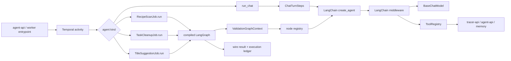
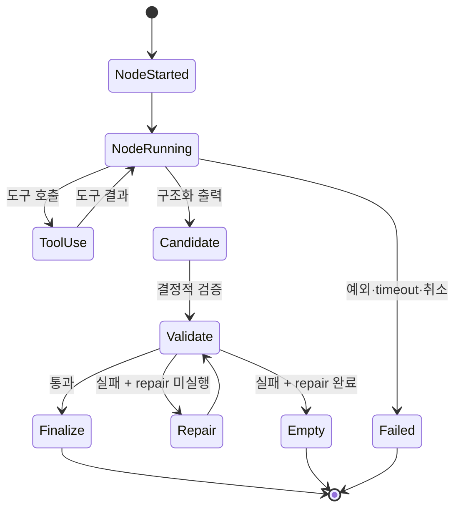
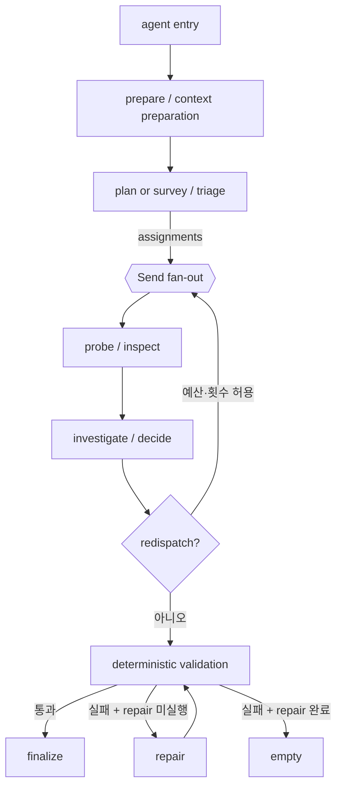
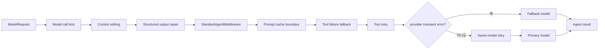
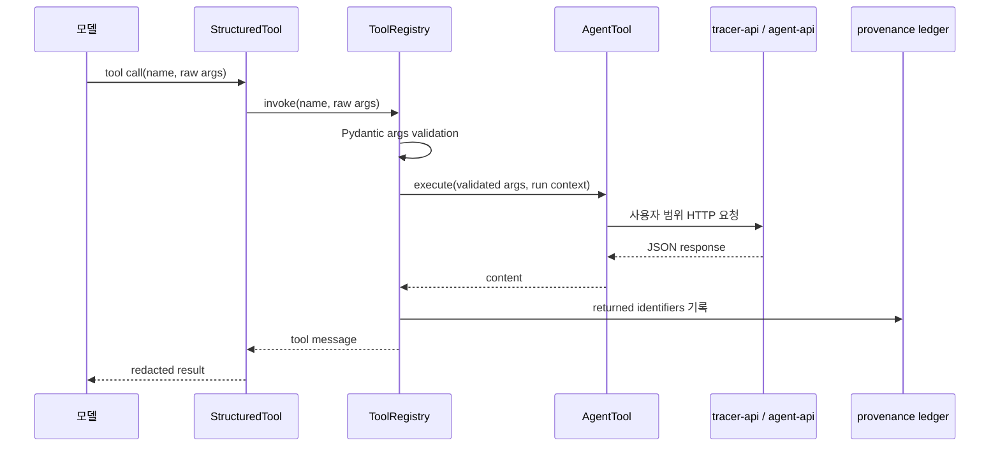
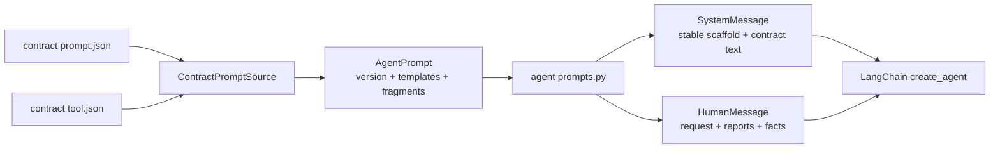
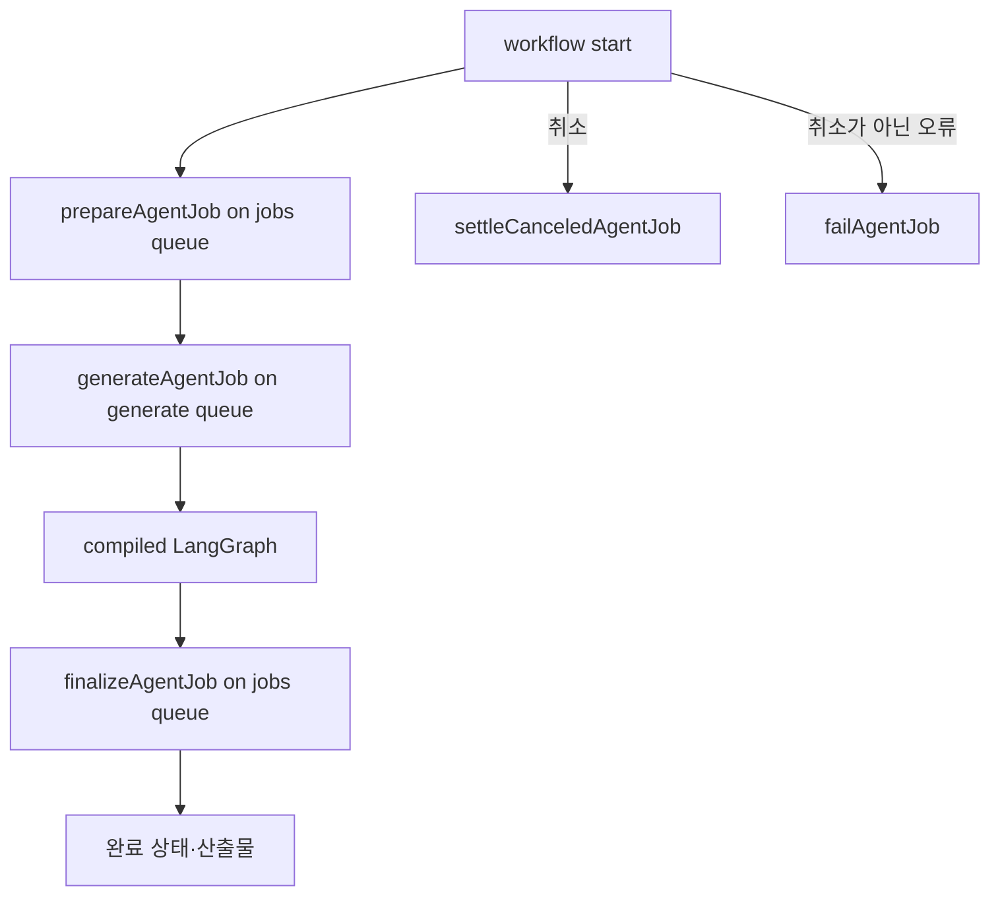

# Python 에이전트 실행 구조

이 문서는 `src/tracer_agent/worker/agents`에 구현된 Python 에이전트의 공통 실행 구조를 정리한다. 잡 셋은 LangGraph 정적 그래프를 세우므로 그래프, 노드 registry, 실행 context, LangChain agent, 미들웨어, 도구 registry의 경계를 분리해 관리한다. 대화는 분기도 팬아웃도 갖지 않아 바깥 그래프를 세우지 않고 `chat/agent.py`가 단계를 차례로 부른다.

## 먼저 확인할 결론

Temporal activity가 에이전트 종류에 따라 잡 하나의 `run`을 호출하고, 그 템플릿이 실행 하나를 열어 요청별 모델·조회 진입점·추적 객체·프롬프트를 주입한다. 잡 셋은 `runtime.job_agent.JobGraphAgent`를 상속해 조립할 노드와 초기 상태와 산출물만 정한다. 그래프 정의는 정적으로 컴파일되어 있으며, 요청별 구현 객체는 `ValidationGraphContext.nodes`에 연결된다.

## 전체 토폴로지

## 에이전트별 문서

개별 에이전트 문서는 다음과 같다.

- [Chat 에이전트](chat/README.md): 대화·메모리·확인 쓰기·스트림
- [Recipe Scan 에이전트](recipe_scan/README.md): survey·probe·investigate·redispatch·repair
- [Task Cleanup 에이전트](task_cleanup/README.md): triage·inspect·investigate·repair
- [Title Suggestion 에이전트](title_suggestion/README.md): investigate·validate·repair

## 노드와 단계

일반적인 노드는 전체 상태의 부분 갱신을 반환한다. `Send` 기반 fan-out 노드는 분기 전용 payload를 입력으로 받고, 병렬 실행 결과는 LangGraph의 상태 병합 규칙에 따라 합쳐진다.

## 타입 체계

| 타입 | 구현 | 책임 |
| --- | --- | --- |
| 상태 | `shared.agents.*.models.*State` | 그래프 전체가 공유하는 실행 입력·부분 갱신·결과를 보유한다 |
| 노드 | `runtime.node.GraphNode[InputT, UpdateT]` | 이름과 비동기 `run` 메서드와 입력·갱신 타입을 결합한다 |
| 노드 registry | `runtime.node.NodeRegistry` | 정적 그래프 노드 이름과 요청별 실행 함수를 연결한다 |
| 실행 context | `runtime.validation_graph.ValidationGraphContext` | 에이전트 이름, 추적 객체, registry, 검증 router를 보유한다 |
| 관측 등록 | `runtime.validation_graph.observed` | 노드 시작·완료·실패와 retry·timeout 메타데이터를 기록한다 |
| 검증 꼬리 | `add_validation_tail` | 검증 → repair 1회 → finalize 또는 empty 경로를 공통화한다 |

## 노드 간 이동

공통 이동 규칙은 다음과 같다.

1. 그래프 진입 노드가 요청을 정규화하고 필요한 외부 문맥을 준비한다.
2. 조사·계획 노드가 다음 노드에 전달할 구조화 payload를 만든다.
3. `Send` fan-out 노드가 전문가별 조사 노드를 병렬 실행한다.
4. 조율 노드가 보고와 provenance를 합성하고 결과 또는 redispatch를 선택한다.
5. 결정적 검증 노드가 식별자·인용·중복·개수·형식 제약을 검사한다.
6. 검증 실패 시 repair 노드를 최대 한 번 실행한다.
7. repair 이후에도 실패하면 에이전트별 empty 경로 또는 유효한 부분 결과로 종료한다.

## 미들웨어에 해당하는 실행 정책

Python 구현에서 미들웨어는 LangChain agent의 실행 전·후 정책이다. `runtime/llm/middleware_stack.py`의 `AgentMiddlewareStack`이 네 에이전트의 층과 그 순서를 소유하고, 산출 형태와 상한 처리 방식만 에이전트가 정한다.

| 미들웨어 | 구현 또는 외부 타입 | 적용 범위 | 책임 |
| --- | --- | --- | --- |
| 모델 호출 상한 | `ModelCallLimitMiddleware`·`TurnLimitMiddleware` | 전체 | `maxTurns` 위에 계약의 `landingReserve.calls` 만큼 얹은 값을 호출 상한으로 적용한다 |
| 컨텍스트 편집 | `context_editing_middleware()` | 전체 | 100,000 token부터 앞선 도구 결과를 정리하고 최근 2개를 유지한다 |
| 산출 복구 | `StructuredOutputRepairMiddleware` | 잡 셋 | 공급자가 강제하지 않는 제약에 걸린 산출을 사유와 함께 한 번 되먹인다 |
| 실행 표준화 | `StandardAgentMiddleware` | 전체 | 비용·메시지·출력 절단·도구 결과·직렬화를 기록하고 모델 호출마다 남은 몫을 알린다 |
| 프롬프트 캐시 | `PromptCacheMiddleware(ttl=cache_write_ttl())` | 전체 | 시스템 prompt와 도구 선언과 안정된 메시지 앞부분에 캐시 경계를 놓는다 |
| 도구 실패 되돌림 | `ToolFailureMiddleware` | 잡 셋 | 재시도가 소진된 도구 실패를 계약의 실패 문구를 담은 도구 결과로 낮춘다 |
| 도구 재시도 | `ToolRetryMiddleware` | 전체 | 선언된 일시 오류를 최대 2회 재시도한다 |
| 대체 모델 | `FallbackModelMiddleware` | 요청에 fallback 모델이 있는 경우 | 과부하·속도 제한·연결 오류에서만 대체 모델을 1회 호출한다 |
| 모델 재시도 | `model_retry_middleware()` | 전체 | 과부하·속도 제한·연결 오류를 같은 모델로 재시도한다 |

캐시 경계가 실행 표준화보다 안쪽에 서는 이유는 남은 몫을 알리는 꼬리가 붙은 뒤에야 그 꼬리 앞에 경계를 놓을 수 있기 때문이다. 꼬리는 호출마다 다시 쓰이므로 그 위에 경계를 놓으면 다음 호출의 앞부분이 달라져 그 항목을 다시 읽지 못한다. 맥락 정리가 비우는 자리는 경계 안쪽이므로 정리가 도는 호출은 접두사를 다시 쓴다.

`FallbackModelMiddleware`는 예산 초과·출력 절단·취소를 fallback 대상으로 바꾸지 않으며, 요청 자체가 틀린 오류도 대체 모델에서 같은 답이 오므로 넘기지 않는다. `model_retry_middleware`도 정의된 공급자 일시 오류 범위 밖의 예외를 재시도하지 않는다. 이 경계는 예산·출력·취소 상태가 상위 실행기로 전달되도록 한다.

`TurnLimitMiddleware`는 상한에 닿은 대화 루프를 끝내되 그 사유를 어시스턴트 발화로 남기지 않는다. 남기면 최종 답변을 고르는 자리가 그 문구를 답으로 본다.

`ToolFailureMiddleware`는 도구 하나의 실패가 그래프를 뚫고 나가 이미 모은 조사를 통째로 잃지 않게 막는다. 실행 전체를 멈추는 신호(취소·예산 초과·출력 절단·데드라인)는 도구 하나의 실패로 낮추지 않고 그대로 올린다. 대화는 도구가 계약의 실패 문구를 스스로 돌려주므로 이 층을 세우지 않는다.

모델이 답의 밀도를 스스로 정하도록 실행 표준화가 호출마다 쓴 턴과 총량을 메시지 꼬리에 붙이고, 예산이 다하면 조사 도구를 거두고 마무리 지시만 남긴다. 두 문구는 `runtime/llm/pacing.py`가 계약의 `agent/shared/execution.budget.json`에서 읽으므로 구현체가 문장을 소유하지 않는다.

## 도구 실행 구조

`runtime.tooling.AgentTool`은 도구 이름, 설명, Pydantic 인자 모델, 실행 함수, 일시 오류 목록, 근거 기록을 하나의 타입으로 결합한다. `ToolRegistry`는 인자를 검증한 뒤 도구 span을 열고, 실행 결과를 provenance/evidence ledger에 기록하며, LangChain `StructuredTool`로 변환한다.

도구는 상태를 갖지 않고 요청별 조회 진입점과 근거 장부를 `execute(args, context)`의 컨텍스트로 받는다. 그 컨텍스트는 `StandardAgentContext`를 확장한 `RecipeToolContext`·`CleanupToolContext`·`TitleToolContext`이며 `create_agent(context_schema=...)`로 선언하고 `ainvoke(context=...)`로 호출마다 싣는다. 도구는 `langgraph.runtime.get_runtime()`으로 그 호출의 컨텍스트만 읽으므로 팬아웃이 병렬로 돌아도 장부가 섞이지 않는다. 에이전트별 `tools/registry.py`가 레지스트리 하나(`RECIPE_TOOLS`·`CLEANUP_TOOLS`·`TITLE_TOOLS`)를 소유하고 모든 실행이 그것을 함께 쓴다.

Chat 도구는 `read`, `agentRead`, `memory`, `confirm` surface로 나뉜다. Recipe Scan과 Task Cleanup은 조사 단계별 provenance ledger를 사용하며, 조율 단계는 조사 보고와 ledger에 기록된 근거만 사용한다.

## 실행 단위 재사용

`create_agent`는 StateGraph를 컴파일하므로 잡 에이전트는 `runtime/llm/model_caller.py`의 `StructuredModelCaller`가 `CompiledAgentCache`를 가지고 시스템 프롬프트와 도구 이름 집합과 출력 타입과 모델 턴 상한이 같은 호출에 같은 agent를 다시 쓴다. 호출자는 한 실행에 속하며 그 실행의 채팅 클라이언트만 담는다. 도구 직렬화 락은 `StandardAgentContext.tool_lock`이 갖고 호출마다 새로 서므로 agent를 함께 쓰는 팬아웃이 서로를 기다리지 않는다.

## 프롬프트 실행 구조

프롬프트의 원천은 `contract/agent/{agent}/prompt.json`과 `tool.json`이다. `ContractPromptSource`가 template과 fragment를 읽고 placeholder를 치환해 `AgentPrompt`를 만든다. 에이전트별 `prompts.py`는 고정 영어 scaffold와 계약 fragment를 결합하고, 실행별 데이터는 user message 또는 메시지 꼬리에 배치한다.

`AgentPrompt.version()`은 template들이 동일한 계약 판을 사용하는지 확인한다. 구조화 에이전트는 `ToolStrategy`로 산출을 도구 하나로 선언해 모델이 조사 도구를 먼저 부른 뒤 답을 낼 수 있게 하고, Chat은 자유 텍스트 응답과 `ChatResult`를 사용한다.

## 대화의 안전 정책 prompt

Chat의 system prompt 앞에는 코드가 소유하는 `SAFETY_POLICY`가 배치된다.
계약이 아니라 `chat/safety_policy.py` 가 이 문장을 갖는 것은 데이터베이스가 쓴 조각이
정책을 덮지 못하게 하기 위해서다.

**TypeScript 구현의 `chat.safety.policy.ts`와 바이트로 같은 문장이다.** 두 축이 같은 신뢰
경계를 모델에게 보이므로 축이 바뀌어도 무엇이 지시문이고 무엇이 데이터인지가 달라지지 않는다.

전문은 `chat/safety_policy.py` 가 갖는다. 문서가 옮겨 적으면 두 벌이 되어 한쪽만 바뀐다.

## 에이전트별 출력 타입

| 에이전트 | 주요 노드 출력 | 최종 결과 |
| --- | --- | --- |
| Chat | `ConverseUpdate` | `ChatResult`: 답변과 확인 대기 write 목록 |
| Recipe Scan | `DispatchPlan`, `ProbeReport`, `RecipeDraft` | recipe 후보와 provenance |
| Task Cleanup | `TriagePlan`, `InspectReport`, `CleanupDraft` | archive 제안 목록 |
| Title Suggestion | `TitleSuggestionDraft` | title 제안 목록 |

## 워크플로 공통 흐름

잡의 생성 액티비티가 다시 태워지면 `prior_spend`가 체크포인트에서 앞선 시도의 달러와 턴을 읽어 `ExecutionBudget`에 실어 준다. 상한은 실행 하나에 한 번만 열리므로 예약과 배분은 남은 잔량에서 이루어진다.

그래프 상태는 지출을 세 쌍의 채널로 나눠 싣는다(`shared/agents/shared/graph_state.py`). `model_cost_usd`·`model_turns_used`는 이 실행의 총 지출이고 재개가 그 두 칸만 읽는다. `pool_cost_usd`·`pool_turns_used`는 예약을 뗀 뒤 팬아웃이 나눠 쓰는 잔량의 소모이며 `remaining_cost_usd`·`remaining_turns`가 그 쌍만 본다. `floor_cost_usd`·`floor_turns_used`는 `synthesisFloor` 예약에서 이미 쓴 몫이라 redispatch로 다시 들어온 종합이 그 예약을 새로 받지 않는다. 노드는 자기 리스의 종류에 따라 `reserved_spend`·`pool_spend`·`floor_then_pool_spend` 가운데 하나로 정산하며 세 잡이 같은 규약을 쓴다.

세 잡 종류가 `agentJobWorkflow` 하나를 함께 쓰고 단계마다 자기 액티비티를 갖는다.
준비는 도메인 문맥만 모으고 자격은 생성 액티비티가 실행 직전에 봉투로 받는다. 준비의 산출은
워크플로 이력에 남으므로 자격이 그 자리에 실리면 이력이 자격을 갖게 된다.

Chat도 스레드 워크플로와 실행 워크플로를 따로 두고 준비·생성·종결·실패를 별도 액티비티로 나눈다.
단계별 큐와 시간 상한과 재시도 상한은 계약의 `workflow/queues.yaml`이 소유하며 자세한 표는
각 에이전트 문서의 Temporal 워크플로 절이 갖는다.

## 코드 탐색 기준점

| 확인 대상 | 기준 파일 |
| --- | --- |
| 노드 계약과 registry | `runtime/node.py` |
| 검증 그래프와 관측 | `runtime/validation_graph.py` |
| 검증 노드와 종단 노드의 기계 | `runtime/validation_nodes.py` |
| 검증 뒤 경로 이름과 그 판정이 읽는 상태 | `runtime/routes.py` |
| 분기 사유 선언과 판정 | `runtime/routing.py`, 에이전트별 `policy.py` |
| 경계를 넘는 JSON 값의 타입 | `shared/agents/shared/json_view.py` |
| HTTP 봉투와 본문 해석 | `shared/agents/shared/wire.py` |
| 시각 표현과 되읽기 | `shared/agents/shared/instant.py` |
| 도구 재시도·모델 재시도 미들웨어 | `runtime/llm/retry.py` |
| 소진된 도구 실패를 결과로 낮추는 층 | `runtime/llm/tool_failure.py` |
| 팬아웃 전에 떼는 예약과 빈 결과 사유 | `worker/agents/shared/execution_reservation.py`, `empty_result.py` |
| 계약 판을 찾는 뿌리 | `shared/agents/shared/contract_root.py` |
| 재개 열쇠와 앞선 시도의 지출 | `runtime/durable_graph.py` |
| 실행 하나의 그래프와 설정과 이어받은 지출 | `runtime/graph_session.py` |
| 잡 하나의 조립·실행·배달 | `runtime/job_agent.py`, 에이전트별 `agent.py`·`outputs.py` |
| 노드가 함께 받는 실행 의존성 | 에이전트별 `deps.py` |
| 모델 호출자와 컴파일 캐시 | `runtime/llm/model_caller.py` |
| 미들웨어 층과 그 순서 | `runtime/llm/middleware_stack.py` |
| LangChain 표준 실행 체인 | `runtime/llm/standard_agent.py` |
| 구조화 출력 실행과 agent 컴파일 | `runtime/llm/structured_agent.py` |
| 그래프 상태의 초기값과 잔량 | `shared/agents/{agent}/models.py`, `shared/agents/shared/graph_state.py` |
| 대체 모델·모델 재시도 | `runtime/llm/fallback.py`, `runtime/llm/retry.py` |
| 실행 예산 | `runtime/llm/budget.py` |
| 도구 계약과 registry | `runtime/tooling.py` |
| 궤적과 관측 | `runtime/execution/trace.py` |
| 대화의 안전 정책 | `chat/safety_policy.py` |
| 잡 워크플로와 액티비티 | `worker/workflows/jobs_workflows.py`, `jobs_activities.py` |
| 대화 워크플로와 액티비티 | `worker/workflows/chat_workflows.py`, `chat_activities.py` |
