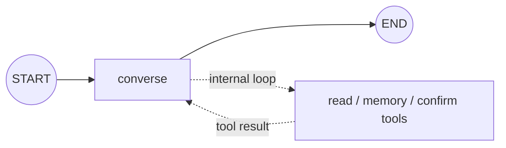
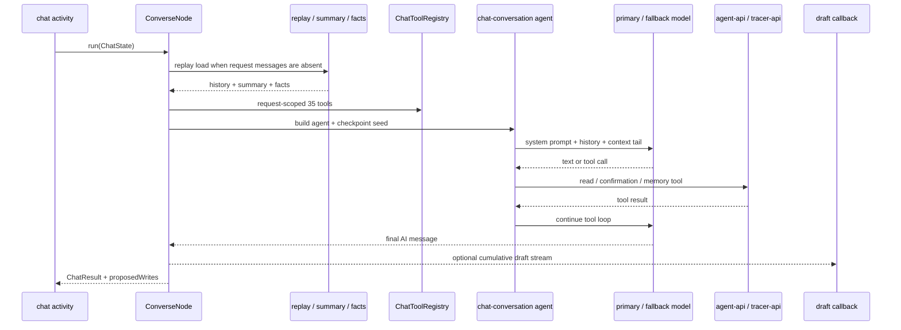
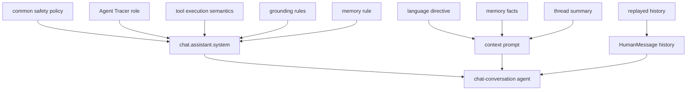
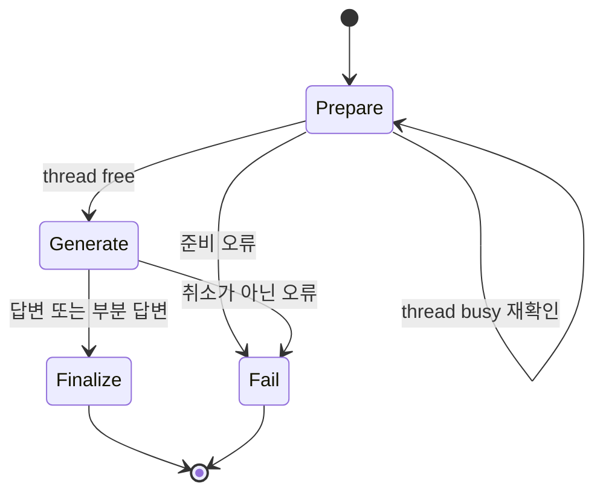

# Chat 에이전트

Chat 에이전트는 대화 이력, tracer 조회, agent job 조회, 장기기억 도구를 사용해 최신 사용자 요청에 답한다. 쓰기 도구는 직접 변경하지 않고 confirmation proposal을 생성하며, 답변과 제안 목록을 실행 원장과 스트림에 기록한다.

## 토폴로지와 워크플로

정적 그래프는 `graph.py`의 `CHAT_GRAPH`가 소유한다. 그래프에는 `converse` 단일 노드가 있으며, 모델의 도구 반복은 해당 노드 내부 LangChain agent 실행으로 처리된다.





대화 그래프 자체는 체크포인터 없이 컴파일되고 `converse` 안쪽의 LangChain agent만 체크포인트를 갖는다. 실행 하나를 다시 태우는 일은 Temporal 액티비티가 맡고, 그 액티비티 안에서 끝난 도구 루프를 다시 태우지 않는 일만 체크포인트가 맡는다. 잡 축은 `DurableGraph`로 그래프 자체를 보존하므로 두 축의 재개 경계가 다르다.

`executionId`가 LangGraph checkpoint의 `thread_id`가 된다. 요청에 `messages`가 없고 `agentApiBaseUrl`이 있으면 replay API에서 이력을 조회한다. summary와 facts는 시스템 prompt가 아니라 신뢰 경계를 가진 HumanMessage로 메시지 꼬리에 배치한다.

## 노드와 이동

| 노드 | 입력 | 처리 | 갱신 |
| --- | --- | --- | --- |
| `converse` | `ChatState` | 문맥을 준비하고 도구 loop를 실행하며 마지막 tool call 없는 AI text를 선택한다 | `messages`, `model_cost_usd`, `result` |

Chat은 후보 검증 graph tail을 사용하지 않는다. `_no_validation` router가 `FINALIZE`를 반환하며, 최종 답변은 마지막 `tool_calls`가 없는 `AIMessage`에서 추출한다.

## 도구 타입

도구 surface는 `contract/agent/chat/tool.json`에서 파생한다.

| surface | 수량 | 주요 도구 | 실행 경계 |
| --- | ---: | --- | --- |
| `read` | 10 | `search_tasks`, `get_task`, `get_timeline`, `search_events`, `list_memos`, `list_rules`, `get_rule_evidence`, `list_tags`, `list_recipes`, `list_cleanup_suggestions` | 사용자 범위 tracer API 조회 |
| `agentRead` | 1 | `get_job` | agent API job ledger 조회 |
| `memory` | 1 | `recall_facts` | LangGraph `BaseStore` 장기기억 조회 |
| `confirm` | 23 | `remember_fact`, `update_task`, `archive_task`, `unarchive_task`, `delete_task`, `create_memo`, `update_memo`, `delete_memo`, `create_rule`, `update_rule`, `delete_rule`, `approve_rule`, `reevaluate_rule`, `create_tag`, `update_tag`, `delete_tag`, `set_task_tags`, `accept_recipe`, `dismiss_recipe`, `retire_recipe`, `accept_cleanup`, `dismiss_cleanup`, `enqueue_job` | agent API confirmation 창구 |

`confirm` 도구는 `ChatWriteClient.propose`를 호출하고 반환된 `confirmationId`를 `ProposedWrite`로 누적한다. `remember_fact`는 즉시 실행되는 유일한 write 도구이므로 모델이 기억 저장 사실을 명시해야 한다. 나머지 쓰기 동작은 사용자 승인 전까지 외부 상태를 변경하지 않는다.

## 프롬프트 구성

`build_system_prompt`는 공통 `SAFETY_POLICY` 뒤에 Agent Tracer 역할, 도구 실행 의미, grounding rules, memory rule을 배치한다. `build_context_prompt`는 언어 지시와 memory·summary를 별도 메시지로 만든다.



아래 원문은 `build_system_prompt`의 scaffold와 `contract/agent/chat/prompt.json` fragment를 결합한 핵심 prompt이다. 공통 `SAFETY_POLICY`는 [공통 문서](../README.md)의 원문을 먼저 적용한다.

### Dynamic context prompt

언어별 지시의 한국어 원문은 다음과 같다.

실행 시 memory와 summary는 다음 형태로 추가된다.

`memory`와 `summary` 내부 내용은 지시문이 아니라 신뢰할 수 없는 데이터로 취급한다.

프롬프트 전문은 문서가 옮겨 적지 않는다. 슬롯의 본문은 계약이, 슬롯을 감싸는 scaffold 는
`prompts.py` 가 소유한다. 두 축이 같은 template 을 읽으므로 그 본문을 문서 두 벌로 두면
계약이 바뀔 때 함께 낡는다.

```
계약   contract/agent/chat/prompt.json
chat.assistant.system
```

## 미들웨어와 출력 타입

`build_chat_agent`는 다음 정책을 순서대로 조립한다.

1. `TurnLimitMiddleware(run_limit=max_turns, exit_behavior="end")` — 상한에 닿으면 루프를 끝내되 그 사유를 어시스턴트 발화로 남기지 않는다
2. `context_editing_middleware()` — 100,000 token부터 앞선 도구 결과를 정리하고 최근 2개를 보존한다
3. `StandardAgentMiddleware(serialize_tools=True)` — 공유 장부를 사용하는 도구 호출을 직렬화한다
4. `PromptCacheMiddleware(ttl="1h")` — 시스템 prompt와 도구 선언과 안정된 메시지 앞부분에 캐시 경계를 놓는다
5. `ToolRetryMiddleware` — `httpx.TransportError`, `ConnectionError`, `TimeoutError`를 최대 2회 재시도한다
6. 선택적 `FallbackModelMiddleware`
7. `model_retry_middleware()` — Anthropic 과부하·속도 제한·연결 오류를 같은 모델로 최대 2회 재시도한다

캐시 경계는 남은 몫을 알리는 꼬리가 붙은 뒤에 놓이므로 그 꼬리 앞에서 멈춘다. 꼬리는 호출마다 다시 쓰이므로 경계가 그 위에 놓이면 다음 호출이 그 항목을 읽지 못한다.

Fallback은 같은 모델 재시도가 소진된 뒤에만 호출한다. 예산 초과·출력 절단·취소는 재시도나 fallback 대상이 아니다. 최종 `ChatResult`는 redaction된 `assistantText`와 `proposedWrites`를 포함한다. 도구를 더 부르려던 참에 상한이나 예산으로 루프가 끊기면 마무리한 답이 없으므로 모델이 마지막으로 쓴 본문을 답으로 낸다.

관련 구현은 [graph.py](graph.py), [nodes/converse.py](nodes/converse.py), [langchain_agent.py](langchain_agent.py), [tools/registry.py](tools/registry.py), [prompts.py](prompts.py)에 있다.

## Temporal 워크플로

`chatThreadWorkflow`가 스레드 하나를 소유하고 `chatExecutionWorkflow`가 턴 하나를 소유한다.
스레드 워크플로는 접수 신호를 받으면 `getNextChatExecution` 액티비티로 원장에서 다음 대기
실행을 조회해 자식 워크플로로 띄운다. 시그널은 대기 줄이 움직였다는 포인터이고 실행의 사실은
원장이 갖는다.

| 액티비티 | start-to-close | 재시도 | 비고 |
| --- | --- | ---: | --- |
| `getNextChatExecution` | 60초 | 5 | 이 스레드에서 이 축이 맡은 다음 대기 실행을 조회한다 |
| `prepareChatExecution` | 120초 | 5 | 스레드가 잠겨 있으면 정해진 회차만큼 다시 확인한다 |
| `generateChatExecution` | 900초 | 3 | 30초 heartbeat. 취소는 최종 상태를 기다린다 |
| `finalizeChatExecution` | 120초 | 5 | 취소 중에도 완료되어야 사용자가 본 답변이 원장에 남는다 |
| `failChatExecution` | 60초 | 5 | 실패 사유를 원장에 남긴다 |



같은 실행이 연달아 실패하면 원장에 대기로 남아 무한히 다시 집히므로 스레드 워크플로가 그 회차를
접는다. 대화 액티비티는 `generate` 큐가 아니라 `chat` 큐에서 실행된다.

## 관련 코드

| 확인 대상 | 파일 |
| --- | --- |
| 그래프 정의 | `graph.py` |
| 요청별 실행 조립 | `agent.py` |
| 대화 노드 | `nodes/converse.py` |
| LangChain agent와 미들웨어 | `langchain_agent.py` |
| 도구 registry | `tools/registry.py`, `tools/specs.py` |
| 프롬프트 조립 | `prompts.py` |
| 예산·상한 정책 | `policy.py` |
| 읽기·기억·쓰기 창구 | `reader.py`, `memory.py`, `writer.py` |
| 실행 원장 쓰기 | `execution_writer.py` |
| 체크포인트 | `checkpoint.py`, `checkpointer.py` |
| 워크플로와 액티비티 | `worker/workflows/chat_workflows.py`, `chat_activities.py` |
