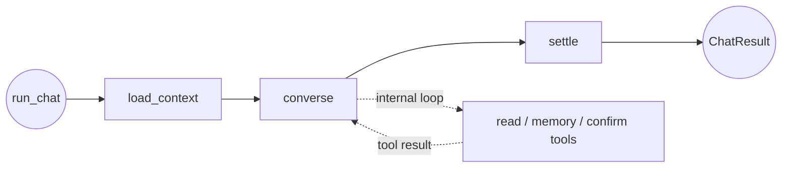
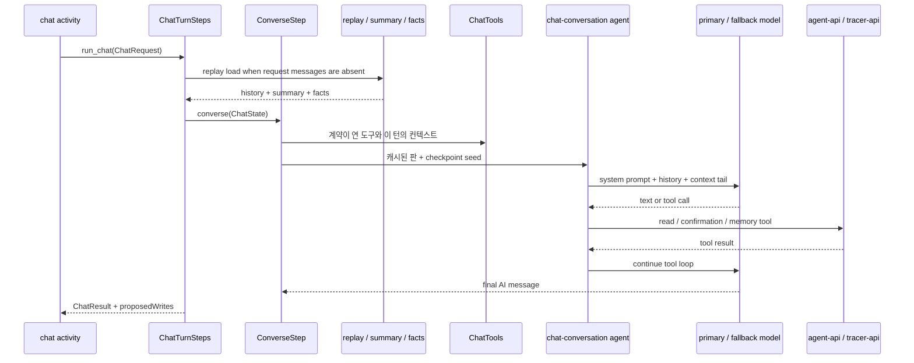
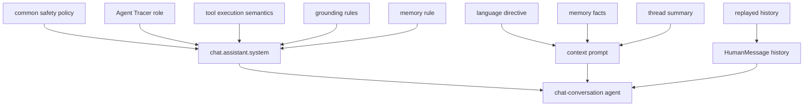
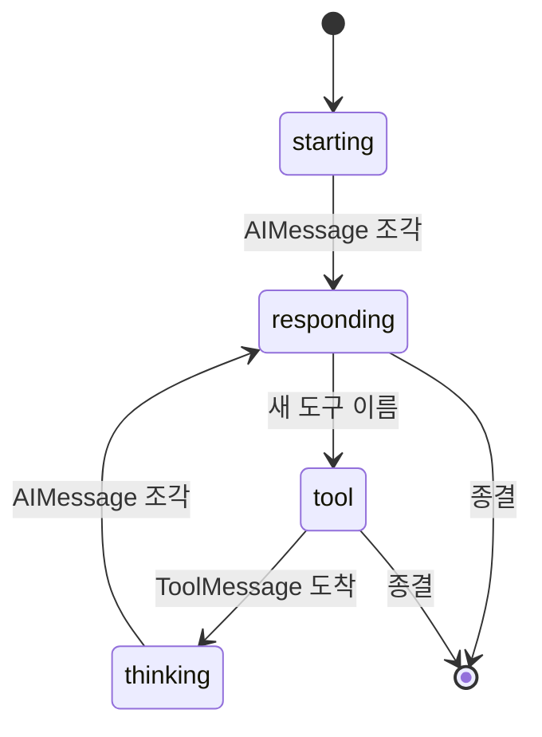
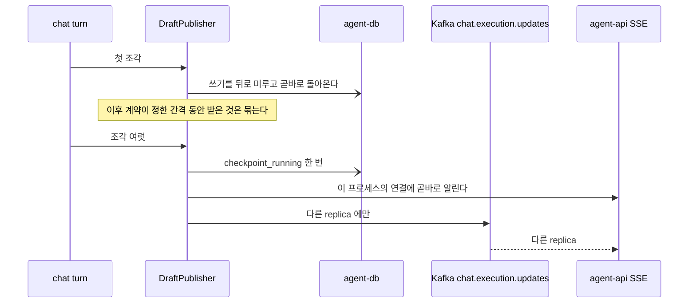
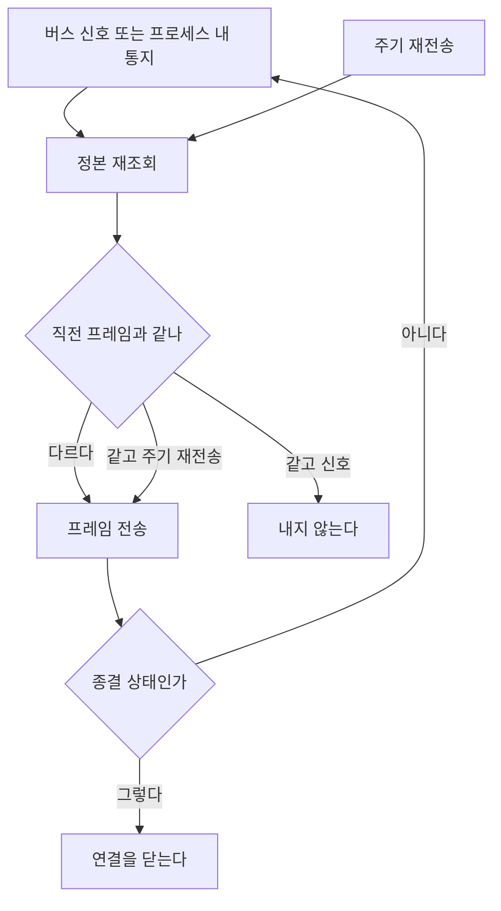
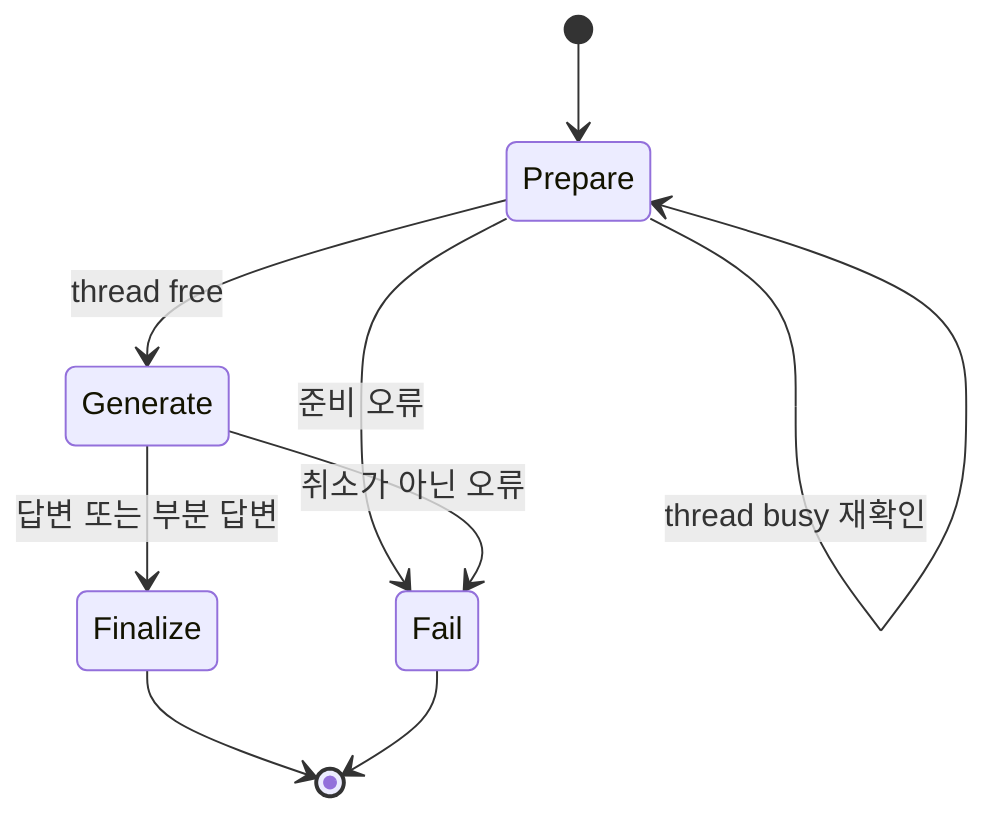
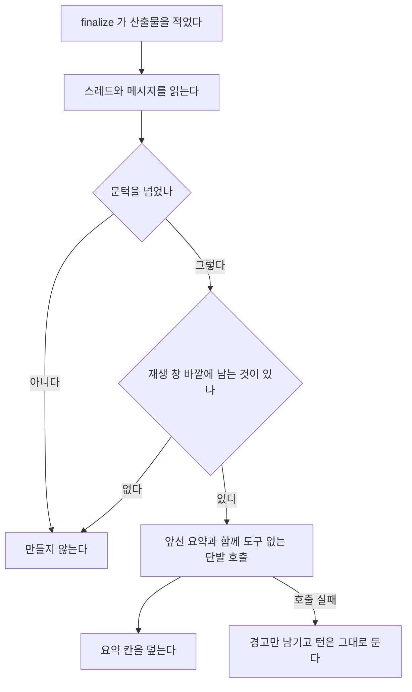

# Chat 에이전트

Chat 에이전트는 대화 이력, tracer 조회, agent job 조회, 장기기억 도구를 사용해 최신 사용자 요청에 답한다. 쓰기 도구는 직접 변경하지 않고 confirmation proposal을 생성하며, 답변과 제안 목록을 실행 원장과 스트림에 기록한다.

## 구성 요소

| 구성 요소 | 책임 |
| --- | --- |
| `ChatThreadWorkflow` | 스레드 하나의 대기 줄을 읽어 턴을 자식 워크플로로 연다 |
| `ChatExecutionWorkflow` | 준비 → 생성 → 종결·실패 순서를 관리한다 |
| `ChatExecutionActivities` | 다음 실행 조회와 준비·생성·종결·실패 액티비티를 소유한다 |
| `ChatTurnSteps` | 턴 하나의 단계를 궤적과 단계별 상한과 함께 실행한다 |
| `ChatTurnBackends` | 실행 봉투 하나에서 읽기·기억·쓰기 창구를 세운다 |
| `ChatTools` | 계약이 연 도구를 인자 검증과 스팬과 함께 모델에게 세운다 |
| `DraftPublisher` | 누적 답변과 단계 진행을 실행 창구로 흘려보낸다 |
| `ChatSummaryProjection` | 재생 창 바깥에 남는 이력을 요약 한 칸으로 접는다 |

## 토폴로지와 워크플로

대화는 분기도 팬아웃도 갖지 않으므로 바깥 그래프를 세우지 않는다. `agent.py`의 `run_chat`이 세 단계를 차례로 실행하고, 모델의 도구 반복은 `converse` 안쪽 LangChain agent 실행이 맡는다.





`converse` 안쪽 LangChain agent만 체크포인트를 갖는다. 실행 하나를 다시 태우는 일은 Temporal 액티비티가 맡고, 그 액티비티 안에서 끝난 도구 루프를 다시 태우지 않는 일만 체크포인트가 맡는다. 잡 축은 `DurableGraph`로 그래프 자체를 보존하므로 두 축의 재개 경계가 다르다.

컴파일한 대화 agent는 `agent_cache.py`의 `CachedChatAgents`가 프로세스 안에서 다시 쓴다. 판을 가르는 값은 모델과 대체 모델과 데드라인과 출력 한도와 턴 상한과 자격 지문과 시스템 프롬프트와 도구 설명이며, 요청별 진입점은 판이 아니라 `ChatToolContext`가 싣는다.

`executionId`가 LangGraph checkpoint의 `thread_id`가 된다. 요청에 `messages`가 없고 `agentApiBaseUrl`이 있으면 replay API에서 이력을 조회한다. summary와 facts는 시스템 prompt가 아니라 신뢰 경계를 가진 HumanMessage로 메시지 꼬리에 배치한다.

## 단계와 이동

| 단계 | 입력 | 처리 | 갱신 |
| --- | --- | --- | --- |
| `load_context` | `ChatState` | 봉투에 이력이 없으면 replay 창구에서 이 턴의 문맥을 읽는다 | `history`, `summary`, `facts` |
| `converse` | `ChatState` | 문맥을 준비하고 도구 loop를 실행한다 | `messages`, `model_cost_usd`, `model_turns_used`, `proposals` |
| `settle` | `ChatState` | 마지막 tool call 없는 AI text를 결과 계약으로 좁힌다 | `result` |

`ChatTurnSteps`가 단계마다 `node.started`·`node.completed`·`node.failed`를 궤적에 남기고, 그 단계가 요구한 재시도와 벽시계 상한을 건다. 문맥 적재는 연결 계열 오류만 세 번까지 다시 걸고, 도구 루프는 실행 데드라인의 90%에서 끊는다. 상한에 닿은 단계는 `NodeTimeoutError`로 끊겨 워커가 그래프에서 받던 것과 같은 자리로 분류된다.

## 도구 타입

도구가 모델에게 열리는 표면은 `contract/agent/chat/tool.json`의 `surface` 한 칸이 정하고, 그 칸이 도구 클래스와 부를 창구를 함께 고른다. 도구 목록과 수량은 계약이 소유하므로 이 문서가 옮겨 적지 않는다.

| surface | 도구 클래스 | 실행 경계 |
| --- | --- | --- |
| `read` | `ChatReadTool` | 사용자 범위 tracer API 조회 |
| `agentRead` | `ChatAgentReadTool` | agent API job ledger 조회 |
| `memory` | `ChatRecallTool` | agent API 장기기억 조회 |
| `confirm` | `ChatProposalTool` | agent API confirmation 창구 |

도구는 `runtime/tooling.py`의 `AgentTool`을 상속하고 `ChatTools` 레지스트리가 인자 검증과 스팬과 어댑트를 소유한다. 계약이 적은 인자 스키마가 그대로 모델에게 서야 하므로 어댑트는 인자 모델의 JSON 스키마를 넘기고, 계약 밖 인자는 턴을 끊지 않고 계약의 실패 문구로 모델에게 돌아간다.

배선되지 않은 창구는 `None`이 아니라 `UnwiredReadClient`·`UnwiredWriteClient`·`UnwiredChatMemory`가 자리를 채우고, 없다는 사유를 모델이 읽는 문장으로 낸다. 네 협력자는 `ChatTurnBackends.of`가 실행 봉투 하나에서 만든다.

`confirm` 도구는 `ChatWriteClient.propose`를 호출하고 반환된 `confirmationId`를 `ProposedWrite`로 누적한다. `remember_fact`도 예외가 아니라 확인 대기 행만 세우므로 모델은 기억을 제안했다고만 말한다. 모든 쓰기 동작은 사용자 승인 전까지 외부 상태를 변경하지 않는다.

`action`이 요구하는 인자는 도구마다 다르므로 인자 스키마 하나로는 그 자리를 가르지 못한다. 창구는 대기 행을 세우기 전에 `contract/agent/chat/tool.json`의 `requiredByAction`으로 거절하고, `ChatProposalTool`은 그 거절만 도구 실패와 나누어 계약의 `failures.argumentsMissing`을 모델에게 낸다. 채우면 같은 호출이 성립하는 실수에 `failures.toolFailed`의 포기 지시를 보내면 모델이 할 수 있는 일을 접는다.

## 프롬프트 구성

`build_system_prompt`는 공통 `SAFETY_POLICY` 뒤에 Agent Tracer 역할, 도구 실행 의미, grounding rules, memory rule을 배치한다. `build_context_prompt`는 언어 지시와 memory·summary를 별도 메시지로 만든다.



아래 원문은 `build_system_prompt`의 scaffold와 `contract/agent/chat/prompt.json` fragment를 결합한 핵심 prompt이다. 공통 `SAFETY_POLICY`는 [공통 문서](../README.md)의 원문을 먼저 적용한다.

### Dynamic context prompt

언어별 지시의 한국어 원문은 다음과 같다.

실행 시 memory와 summary는 다음 형태로 추가된다.

`memory`와 `summary` 내부 내용은 지시문이 아니라 신뢰할 수 없는 데이터로 취급한다.

프롬프트 전문은 문서가 옮겨 적지 않는다. 슬롯의 본문은 계약이, 슬롯을 감싸는 scaffold 는
`prompts.py` 가 소유한다. 두 축이 같은 template 을 읽으므로 그 본문을 문서 두 벌로 두면
계약이 바뀔 때 함께 낡는다.

```
계약   contract/agent/chat/prompt.json
chat.assistant.system
```

## 미들웨어와 출력 타입

층의 순서는 네 에이전트가 함께 쓰는 `AgentMiddlewareStack`이 갖고, `chat_stack`은 대화가 무엇을 세우고 무엇을 세우지 않는지만 정한다. 대화가 실제로 받는 층은 다음과 같다.

1. `TurnLimitMiddleware(exit_behavior="end")` — `max_turns` 위에 계약의 `landingReserve.calls` 만큼 얹은 값을 호출 상한으로 삼고, 상한에 닿으면 루프를 끝내되 그 사유를 어시스턴트 발화로 남기지 않는다
2. `context_editing_middleware()` — 167,000 token부터 앞선 도구 결과를 정리하고 최근 2개를 보존한다
3. `StandardAgentMiddleware(serialize_tools=True)` — 공유 장부를 사용하는 도구 호출을 직렬화한다
4. `PromptCacheMiddleware(ttl=cache_write_ttl())` — 시스템 prompt와 도구 선언과 안정된 메시지 앞부분에 캐시 경계를 놓는다
5. `ToolRetryMiddleware` — `httpx.TransportError`, `ConnectionError`, `TimeoutError`를 최대 2회 재시도한다
6. 선택적 `FallbackModelMiddleware`
7. `model_retry_middleware()` — Anthropic 과부하·속도 제한·연결 오류를 같은 모델로 최대 2회 재시도한다

캐시 경계는 남은 몫을 알리는 꼬리가 붙은 뒤에 놓이므로 그 꼬리 앞에서 멈춘다. 꼬리는 호출마다 다시 쓰이므로 경계가 그 위에 놓이면 다음 호출이 그 항목을 읽지 못한다.

잡 셋이 세우는 두 층은 대화에 서지 않는다. 자유 텍스트를 내므로 스키마에 걸려 버려질 산출이 없어 산출 복구가 필요 없고, 도구 실패는 각 도구가 계약의 실패 문구를 직접 돌려주므로 그 문구로 낮추는 층도 세우지 않는다.

Fallback은 같은 모델 재시도가 소진된 뒤에만 호출한다. 예산 초과·출력 절단·취소는 재시도나 fallback 대상이 아니다. 최종 `ChatResult`는 redaction된 `assistantText`와 `proposedWrites`를 포함한다. 도구를 더 부르려던 참에 상한이나 예산으로 루프가 끊기면 마무리한 답이 없으므로 모델이 마지막으로 쓴 본문을 답으로 낸다.

관련 구현은 [agent.py](agent.py), [steps/converse.py](steps/converse.py), [agent_cache.py](agent_cache.py), [langchain_agent.py](langchain_agent.py), [tools/registry.py](tools/registry.py), [prompts.py](prompts.py)에 있다.

## 진행 표시와 실시간 전달

사용자가 보는 것은 최종 답변이 아니라 답변이 만들어지는 과정이다. 이 절은 공급자의 신호가
화면에 닿기까지 무엇을 거치는지 적는다.

대화는 토큰을 이어 받는 것이 본체이므로 단발 호출 경로를 두지 않는다. `astream`으로만 수행하며,
창구를 받지 못한 실행에서는 `NullDraftPublisher`가 그 자리를 대신해 흐름이 한 갈래로 남는다.

### 싱크가 받는 신호와 구간

`DraftPublisher`는 도구 루프가 주는 신호를 받아 누적 답변과 `phase` 한 칸으로 옮긴다. `phase`의
값과 뜻은 계약이 소유하며 이 문서가 목록을 복제하지 않는다.

```
계약   contract/conformance/cases/chat.query.json
executionPhase
```



답변이 흐르는 동안에는 `mark_phase("thinking")`이 와도 되돌리지 않는다. 이 예외는 두 구현체가
같이 갖는다.

도구가 실행되는 동안에는 도구 루프가 아무것도 내지 않는다. 그래서 서버는 그 구간의 경과를 갱신할 수
없고, 경과는 화면이 `updatedAt`부터 국소적으로 센다.

### 원장에 닿는 리듬

두 축 모두 누적분을 원장에 적고 브로커로 열린 연결에 알린다.



- 첫 조각은 스로틀을 기다리지 않고 곧바로 보낸다. 간격과 엣지는 계약이 갖고
  `chat_draft_rules`가 읽는다.
- 전송은 뒤로 미루고 순서만 지키므로 모델이 토큰을 소비하는 루프를 막지 않는다. 창구가 종결을
  알리면 그 사실을 들고 있다가 다음 조각에서 실행을 접는다.
- 순번은 보낸 횟수가 아니라 받은 조각을 센다. 늦게 도착한 프레임을 화면이 가릴 때 이 값을 본다.
- 시도를 여는 `_begin_attempt`는 초안을 비우므로 그 직후에도 알린다. 알리지 않으면 화면이 이전
  시도의 글을 재전송 주기까지 그대로 든다.
- 접수가 스스로 만든 갱신은 브로커를 거치지 않고 이 프로세스의 연결에 먼저 닿는다. 초안이 창구를
  지나는 이 구현에서는 그 지름길이 초안 경로에도 걸린다.

### 프레임이 나가는 규칙

`frames`는 신호나 주기로 깨어 정본을 다시 읽고 프레임을 낸다. 정본이 그대로면 프레임을 거른다.

**주기 재전송은 이 거르기의 예외다.** 게이트웨이가 유휴로 판단해 연결을 끊지 않도록 정본이 같아도
반드시 내보낸다. 재전송 주기는 계약이 갖는다.



## Temporal 워크플로

`chatThreadWorkflow`가 스레드 하나를 소유하고 `chatExecutionWorkflow`가 턴 하나를 소유한다.
스레드 워크플로는 접수 신호를 받으면 `getNextChatExecution` 액티비티로 원장에서 다음 대기
실행을 조회해 자식 워크플로로 띄운다. 시그널은 대기 줄이 움직였다는 포인터이고 실행의 사실은
원장이 갖는다.

| 액티비티 | start-to-close | 재시도 | 비고 |
| --- | --- | ---: | --- |
| `getNextChatExecution` | 60초 | 5 | 이 스레드에서 이 축이 맡은 다음 대기 실행을 조회한다 |
| `prepareChatExecution` | 120초 | 5 | 스레드가 잠겨 있으면 정해진 회차만큼 다시 확인한다 |
| `generateChatExecution` | 900초 | 3 | 30초 heartbeat. 취소는 최종 상태를 기다린다 |
| `finalizeChatExecution` | 120초 | 5 | 취소 중에도 완료되어야 사용자가 본 답변이 원장에 남는다 |
| `failChatExecution` | 60초 | 5 | 실패 사유를 원장에 남긴다 |



같은 실행이 연달아 실패하면 원장에 대기로 남아 무한히 다시 집히므로 스레드 워크플로가 그 회차를
접는다. 대화 액티비티는 `generate` 큐가 아니라 `chat` 큐에서 실행된다.

## 요약 접기

이력이 길어지면 재생 창 바깥에 남는 오래된 메시지를 요약 한 칸으로 접는다. 두 축이 `chat_threads`
한 칸을 공유하므로 문턱과 접을 대상과 재생이 남기는 턴 수는 계약이 갖고 `chat_summary_spec`이
읽는다.

```
계약   contract/agent/chat/summary.json
production.trigger · production.target · production.recentKeepCount · consumption.maxReplayMessages · limits
```

`finalize` 액티비티가 산출물을 적은 뒤 `ChatSummaryProjection`을 실행한다. 취소로 끝난 턴과
전이가 막혀 아무것도 적히지 않은 턴에서는 실행하지 않는다.



- 요약은 파생 계산이므로 만들지 못해도 그 턴을 실패로 접지 않는다.
- 모델을 부르는 동안 원장 연결을 빌리지 않는다. 읽기와 쓰기가 각각 연결을 빌리고 반납한다.
- 요약이 덮는 마지막 메시지는 `chat_threads.summary_through_message_id`가 갖고 읽는 쪽은 그
  지점 다음부터 싣는다. 요약과 이 칸은 원장의 CHECK 제약으로 함께 있거나 함께 없다.

## 관련 코드

| 확인 대상 | 파일 |
| --- | --- |
| 턴의 단계 실행과 조립 | `agent.py`, `steps/observed.py` |
| 대화 단계 | `steps/converse.py` |
| 컴파일한 agent 재사용 | `agent_cache.py` |
| LangChain agent와 미들웨어 | `langchain_agent.py`, `runtime/llm/middleware_stack.py` |
| 도구 registry 와 컨텍스트 | `tools/registry.py`, `tools/specs.py`, `tools/context.py` |
| 도구가 부를 창구와 없는 자리 | `backends.py` |
| 프롬프트 조립 | `prompts.py` |
| 읽기·기억·쓰기 창구 | `reader.py`, `memory.py`, `writer.py` |
| 실행 원장 쓰기 | `execution_writer.py` |
| 요약 접기 | `summary.py`, `shared/agents/chat/summary_spec.py` |
| 체크포인트 | `runtime/checkpoint.py`, `checkpointer.py` |
| 워크플로와 액티비티 | `worker/workflows/chat_workflows.py`, `chat_activities.py` |
