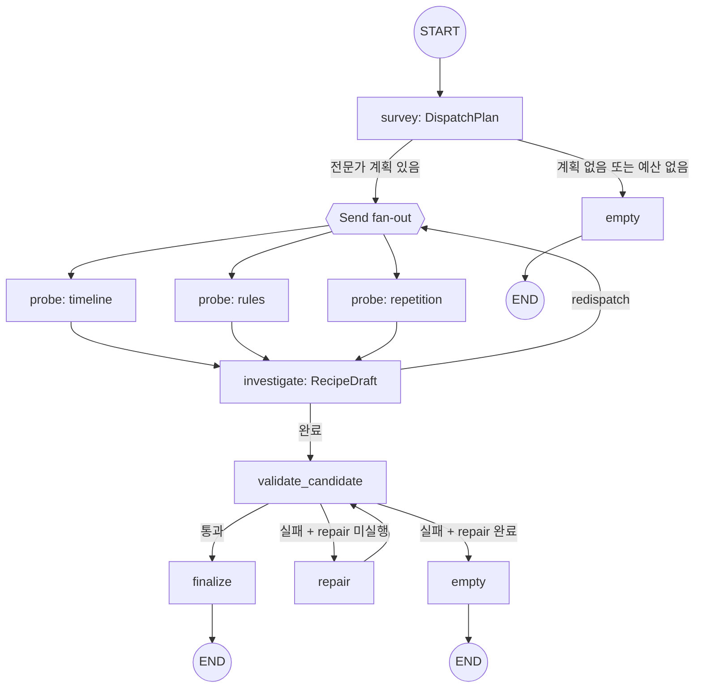
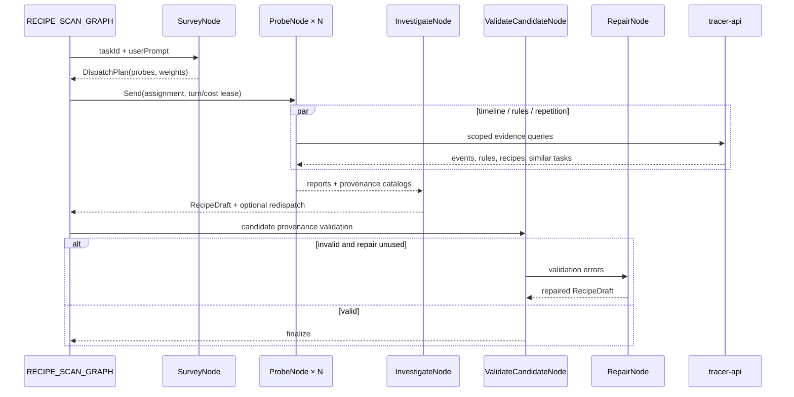
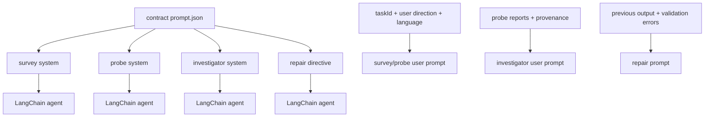
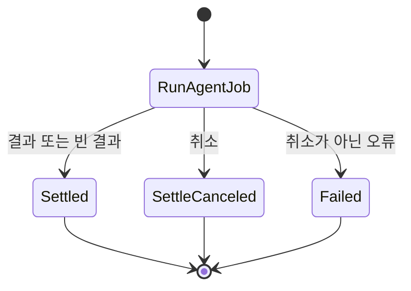

# Recipe Scan 에이전트

Recipe Scan 에이전트는 기준 task와 관련 task의 event·rule·recipe를 조사해 재사용 가능한 recipe 후보를 생성한다. `survey`가 전문가 조사를 계획하고, `probe`가 병렬로 근거를 수집하며, `investigate`가 후보를 종합한다. provenance 검증에 실패하면 `repair`를 한 번 수행한다.

## 토폴로지와 워크플로





예약 순서는 `repair → survey → synthesisFloor`이다. 남은 turn·cost는 `lease_shares`로 전문가 weight에 따라 배분한다. `survey` 실패는 빈 계획으로 강등되어 `empty`로 이동한다. `probe` 예외는 실패 보고로 변환되며, fan-out 이후 보고와 provenance를 병합한다.

## 노드와 이동

| 노드 | 입력 | 처리 | 갱신 또는 결과 |
| --- | --- | --- | --- |
| `survey` | `RecipeScanState` | 조사 전문가와 weight를 구조화 출력으로 결정한다 | `plan`, 비용 |
| `probe` | `ProbeDispatch` | 할당된 질문을 전용 도구·예산·근거 장부로 조사한다 | `reports`, `provenance`, 비용, 사용 turn |
| `investigate` | `RecipeScanState` | 전문가 보고를 종합해 `RecipeDraft`를 만들고 필요하면 redispatch를 요청한다 | `candidates`, `messages`, `redispatch` |
| `validate_candidate` | `RecipeScanState` | task·event·turn·rule·recipe revision 인용을 provenance와 대조한다 | `validation_errors` |
| `repair` | `RecipeScanState` | 검증 오류를 포함한 수정 지시로 후보를 한 번 다시 생성한다 | 후보·provenance 갱신 |
| `finalize` | `RecipeScanState` | 후보와 `ProvenanceCatalog`를 wire 결과로 직렬화한다 | `recipes`, `provenance` |
| `empty` | `RecipeScanState` | 후보가 없거나 검증이 소진된 결과를 직렬화한다 | 빈 `recipes` |

`MAX_REDISPATCH_ROUNDS`를 넘는 재배정은 허용하지 않는다. 기준 task는 후보의 `contributing_slices`에 포함되어야 하며, 동일 turn의 중복 인용은 검증에서 거부한다.

## 도구 타입

| 도구 | 주요 인자 | 역할 | 근거 기록 |
| --- | --- | --- | --- |
| `get_task_summary` | `taskId`, `window` | 기준 task의 저비용 요약과 초기 event를 조회한다 | 없음 |
| `get_task_events` | `taskId`, `limit`, `cursor`, `order` | task event 페이지를 조회한다 | event ID, turn ID |
| `list_rules` | `taskId` | 적용 가능한 rule을 조회한다 | rule ID |
| `search_events` | `q`, `taskId`, `kind`, `toolName`, `limit`, `offset` | task를 가로지르는 event를 검색한다 | event ID, 선택적 task ID |
| `find_similar_tasks` | `anchorTaskId`, `limit` | 기준 task와 유사한 task를 조회한다 | 없음 |
| `search_recipes` | `q`, `limit` | 등록된 recipe와 revision을 조회한다 | recipe revision |
| `check_citations` | `taskId`, `eventIds`, `turnIds`, `ruleIds` | 조율자가 사용할 citation이 ledger에 존재하는지 확인한다 | ledger 조회 |

전문가별 도구 권한은 `timeline = summary/events/search/check`, `rules = list_rules/search_recipes/check`, `repetition = search_events/find_similar/check`, 조율자 = `check_citations`이다. `ToolRegistry`는 Pydantic 인자를 검증하고 도구 span과 provenance를 기록한다.

## 프롬프트 구성

| 프롬프트 | 계약 template | 실행 단계 |
| --- | --- | --- |
| investigator system | `recipe-scan.investigator.system` | report 종합·candidate 생성 |
| survey system | `recipe-scan.survey.system` | specialist dispatch 계획 |
| probe system | `recipe-scan.probe.system` | specialist 조사·보고 |
| repair directive | `recipe-scan.investigator.repair` | validation 오류 수리 |



아래 원문은 `recipe_scan/prompts.py`의 scaffold와 `contract/agent/recipe-scan/prompt.json`의 fragment를 결합한 핵심 prompt이다. `${...}`는 실행 시 실제 제한값이나 도구 이름으로 치환된다.

### Survey·probe·repair prompt 원문

실행별 user prompt는 `Anchor taskId`, `User direction`, `Output language`, 후보 상한, specialist plan, report를 순서대로 추가한다. 관련 구현은 [graph.py](graph.py), [nodes](nodes/), [langchain_agent.py](langchain_agent.py), [tools/registry.py](tools/registry.py), [prompts.py](prompts.py), [policy.py](policy.py)에 있다.

프롬프트 전문은 문서가 옮겨 적지 않는다. 슬롯의 본문은 계약이, 슬롯을 감싸는 scaffold 는
`prompts.py` 가 소유한다. 두 축이 같은 template 을 읽으므로 그 본문을 문서 두 벌로 두면
계약이 바뀔 때 함께 낡는다.

```
계약   contract/agent/recipe-scan/prompt.json
recipe-scan.investigator.system
recipe-scan.investigator.repair
recipe-scan.survey.system
recipe-scan.probe.system
```

## 미들웨어와 출력 타입

`build_recipe_agent`는 prompt cache, model call limit, context editing, standardization, tool retry, 선택적 fallback, model retry를 사용한다. 구조화 출력은 `ToolStrategy(output, handle_errors=True)`로 처리하며 `DispatchPlan`, `ProbeReport`, `RecipeDraft`를 사용한다. 최종 검증은 후보의 provenance와 인용 식별자를 결정적으로 대조한다.

## Temporal 워크플로

세 잡 종류를 `agentJobWorkflow` 하나가 받는다. 준비와 종결을 별도 액티비티로 두지 않고
`runAgentJob` 실행 액티비티 안에서 처리하며 그 하나를 `generate` 큐로 보낸다. 잡 종류마다
워크플로를 두는 TypeScript 구현과 갈라진 자리이며 `divergence.json`의 `job.workflow.shape`가
그것을 갖는다.

| 액티비티 | 큐 | start-to-close | 재시도 | 비고 |
| --- | --- | --- | ---: | --- |
| `runAgentJob` | `generate` | 900초 | 3 | 30초 heartbeat. 실행 체인 전체가 이 안에서 돈다 |
| `settleCanceledAgentJob` | `jobs` | 30초 | — | 취소된 잡의 원장을 접는다 |



**재시도 경계가 실행 체인 전체를 감싼다.** 노드 하나가 실패해도 그래프가 처음부터 다시 돌므로
선언한 예산의 3배를 소진할 수 있다. 종착지는 노드마다 액티비티 하나이며 `divergence.json`의
같은 항목이 그 두 단계 수렴을 적는다.

## 관련 코드

| 확인 대상 | 파일 |
| --- | --- |
| 그래프 정의 | `graph.py` |
| 요청별 실행 조립 | `agent.py` |
| 조사·조율 노드 | `nodes/survey.py`, `nodes/probe.py`, `nodes/candidate.py` |
| LangChain agent와 미들웨어 | `langchain_agent.py` |
| 도구 registry | `tools/registry.py` |
| 프롬프트 조립 | `prompts.py` |
| 예산·팬아웃 정책 | `policy.py`, `reservation.py` |
| 추적 API 읽기 | `reader.py`, `search.py`, `summary.py` |
| 워크플로와 액티비티 | `worker/workflows/jobs_workflows.py`, `jobs_activities.py` |
