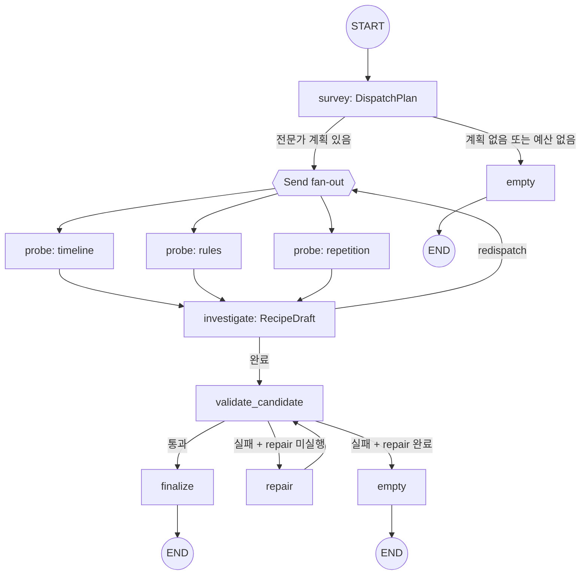
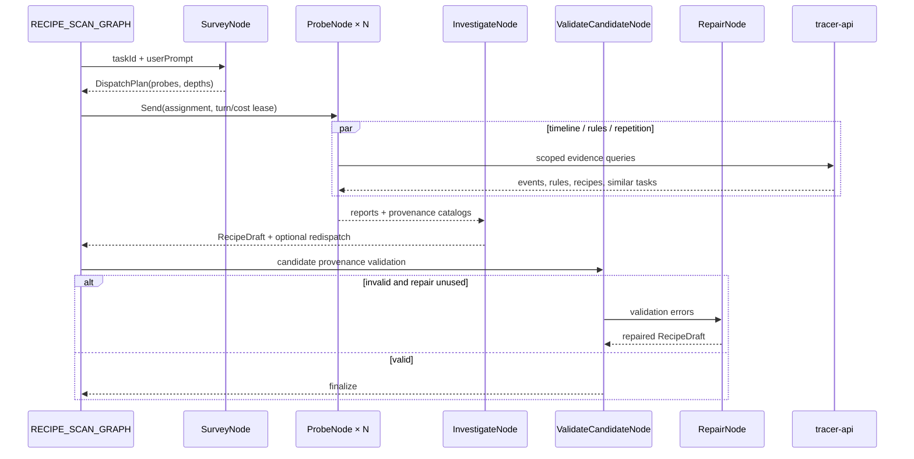
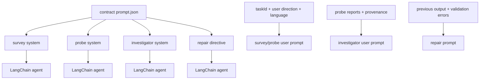
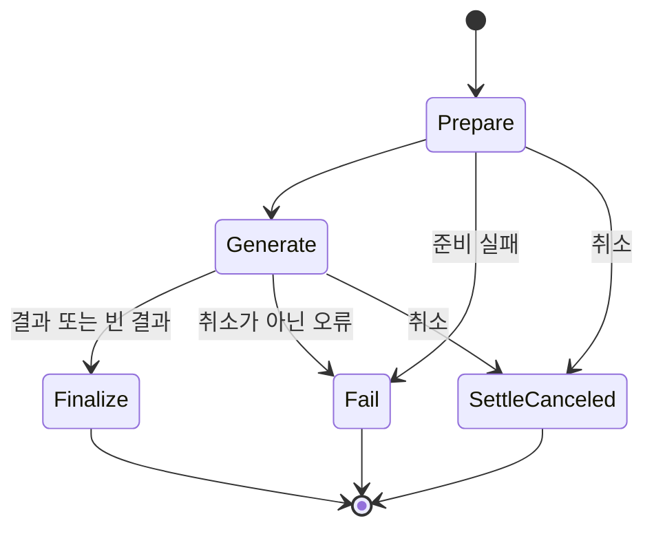

# Recipe Scan 에이전트

Recipe Scan 에이전트는 기준 task와 관련 task의 event·rule·recipe를 조사해 재사용 가능한 recipe 후보를 생성한다. `survey`가 전문가 조사를 계획하고, `probe`가 병렬로 근거를 수집하며, `investigate`가 후보를 종합한다. provenance 검증에 실패하면 `repair`를 한 번 수행한다.

## 토폴로지와 워크플로





예약 순서는 `repair → survey → synthesisFloor`이다. 남은 turn·cost는 `lease_shares`로 전문가가 고른 depth의 몫에 따라 배분한다. `survey` 실패는 빈 계획으로 낮춰져 `empty`로 이동한다. `probe` 예외는 실패 보고로 변환되며, fan-out 이후 보고와 provenance를 병합한다.

## 노드와 이동

| 노드 | 입력 | 처리 | 갱신 또는 결과 |
| --- | --- | --- | --- |
| `survey` | `RecipeScanState` | 조사 전문가와 depth를 구조화 출력으로 결정한다 | `plan`, 비용 |
| `probe` | `ProbeDispatch` | 할당된 질문을 전용 도구·예산·근거 장부로 조사한다 | `reports`, `provenance`, 비용, 사용 turn |
| `investigate` | `RecipeScanState` | 전문가 보고를 종합해 `RecipeDraft`를 만들고 필요하면 redispatch를 요청한다 | `candidates`, `messages`, `redispatch` |
| `validate_candidate` | `RecipeScanState` | task·event·turn·rule·recipe revision 인용을 provenance와 대조한다 | `validation_errors` |
| `repair` | `RecipeScanState` | 검증 오류를 포함한 수정 지시로 후보를 1회 다시 생성한다 | 후보·provenance 갱신 |
| `finalize` | `RecipeScanState` | 후보와 `ProvenanceCatalog`를 wire 결과로 직렬화한다 | `recipes`, `provenance` |
| `empty` | `RecipeScanState` | 후보가 없거나 검증이 소진된 결과를 직렬화한다 | 빈 `recipes` |

후보 없이 끝난 실행은 `finalize`와 `empty` 두 자리 모두에서 왜 비었는지를 `route.selected`
궤적 이벤트로 남긴다. 사유의 어휘와 기본값은 계약의 `agent/shared/execution.budget.json`
`orchestratorFailureDemotion.emptyResultReason`이 소유하며 `shared/empty_result.py`가 읽는다.
`survey` 실패와 `repair` 예산 소진은 그 자리에서 `generation-degraded`를 상태에 적고,
나머지는 종단 노드가 검증 오류와 보고를 세우지 못한 전문가와 전문가 소진 여부를 이 순서로 보고 판정한다.
보고를 세우지 못하고 죽은 전문가는 `failed_probes` 채널에 쌓여 조사 단계가 실패한 것으로 세므로,
조사를 마치고 근거가 모자랐던 실행과 갈린다.

`MAX_REDISPATCH_ROUNDS`를 넘는 재배정은 허용하지 않는다. 기준 task는 후보의 `contributing_slices`에 포함되어야 하며, 동일 turn의 중복 인용은 검증에서 거부한다.

`result_of`는 직렬화한 산출을 계약의 `agent/shared/redaction.json` `stages.output` 자리로 통과시킨다.
그 한 벌이 잡 원장과 조회 표면과 레시피 원장 쓰기로 함께 나가므로 가림도 그 자리 하나에 선다.

한 계획이 같은 축을 두 번 담으면 `DispatchPlan`과 `RecipeDraft.redispatch`가 그 계획을 거부한다.
축을 가리키는 필드와 그 규칙은 계약의 `agent/shared/dispatch.plan.json` `uniqueness`가 소유한다.
거부된 계획은 `StandardAgentMiddleware`가 궤적에 실은 뒤 구조화 복구가 사유와 함께 한 번 되돌려
주므로, 겹친 배정은 관측에 남고 조율자는 남은 축을 덮는 계획을 다시 낼 기회를 얻는다.

## 자기 원장에 적는 후보

`outputs.py`의 `_ROW_FIELDS`가 후보의 칸을 `agent-db` 의 `recipes` 열로 옮긴다. 목록에 없는 칸은
원장에 적히지 않으므로 후보에만 선 값은 저장되지 않는다. 모델의 `revises_recipe_id`는
`parent_recipe_id`가 되며, 이 실행이 본 판(`provenance.recipeRevs`)이 지금 판과 같을 때만 적고
어긋나면 부모를 비운다. 적는 칸과 종결 단계가 정하는 값은 계약의
`conformance/cases/recipe.ledger.json`의 `ledgerWrite`가 소유한다.

후보 한 벌과 그 색인 적재 행은 한 트랜잭션에 함께 적힌다. 같은 `source_job_id` 로 적힌 후보가 이미
있으면 아무것도 쓰지 않으므로 같은 잡의 재시도가 후보를 두 벌 만들지 않는다.

답변 언어는 후보가 아니라 이 실행이 갖는 값이라 종결이 요청 payload에서 꺼내 쓰기로 넘기고
`_to_row`가 행마다 적는다. 요청이 언어를 정하지 않았으면 정하지 않았다는 표시를 그대로 적으며
그 글자는 실제로 쓰인 언어가 아니다. 정본 축도 조건 없이 같은 값을 적는다.

## 도구 타입

| 도구 | 주요 인자 | 역할 | 근거 기록 |
| --- | --- | --- | --- |
| `get_task_summary` | `taskId`, `window` | 기준 task의 저비용 요약과 초기 event를 조회한다 | 없음 |
| `get_task_events` | `taskId`, `limit`, `cursor`, `order` | task event 페이지를 조회한다 | event ID, turn ID |
| `list_rules` | `taskId` | 적용 가능한 rule을 조회한다 | rule ID |
| `search_events` | `q`, `taskId`, `kind`, `toolName`, `limit`, `offset` | task를 가로지르는 event를 검색한다 | event ID, 선택적 task ID |
| `find_similar_tasks` | `anchorTaskId`, `limit` | 기준 task와 유사한 task를 조회한다 | 없음 |
| `search_recipes` | `q`, `limit` | 등록된 recipe와 revision을 조회한다 | recipe revision |

전문가별 도구 권한은 `timeline = summary/events/search`, `rules = list_rules/search_recipes`, `repetition = search_events/find_similar`이다. 조율자는 도구를 갖지 않고 인용 가능한 식별자를 요청으로 받는다. `ToolRegistry`는 Pydantic 인자를 검증하고 도구 span과 provenance를 기록한다.

## 프롬프트 구성

| 프롬프트 | 계약 template | 실행 단계 |
| --- | --- | --- |
| investigator system | `recipe-scan.investigator.system` | report 종합·candidate 생성 |
| survey system | `recipe-scan.survey.system` | specialist dispatch 계획 |
| probe system | `recipe-scan.probe.system` | specialist 조사·보고 |
| repair directive | `recipe-scan.investigator.repair` | validation 오류 수리 |



아래 원문은 `recipe_scan/prompts.py`의 scaffold와 `contract/agent/recipe-scan/prompt.json`의 fragment를 결합한 핵심 prompt이다. `${...}`는 실행 시 실제 제한값이나 도구 이름으로 치환된다.

### Survey·probe·repair prompt 원문

실행별 user prompt는 `Anchor taskId`, `User direction`, `Output language`, 후보 상한, specialist plan, report를 순서대로 추가한다. 관련 구현은 [graph.py](graph.py), [nodes](nodes/), [tools/registry.py](tools/registry.py), [prompts.py](prompts.py), [policy.py](policy.py)에 있다.

프롬프트 전문은 문서가 옮겨 적지 않는다. 슬롯의 본문은 계약이, 슬롯을 감싸는 scaffold 는
`prompts.py` 가 소유한다. 두 축이 같은 template 을 읽으므로 그 본문을 문서 두 벌로 두면
계약이 바뀔 때 함께 낡는다.

```
계약   contract/agent/recipe-scan/prompt.json
recipe-scan.investigator.system
recipe-scan.investigator.repair
recipe-scan.survey.system
recipe-scan.probe.system
```

## 미들웨어와 출력 타입

`AgentMiddlewareStack`이 model call limit, context editing, 구조화 복구, standardization, prompt cache, 도구 실패 되돌림, tool retry, 선택적 fallback, model retry를 이 순서로 세운다. 구조화 출력은 `ToolStrategy(output, handle_errors=True)`로 처리하며 `DispatchPlan`, `ProbeReport`, `RecipeDraft`를 사용한다. 최종 검증은 후보의 provenance와 인용 식별자를 결정적으로 대조한다.

## Temporal 워크플로

세 잡 종류를 `agentJobWorkflow` 하나가 받고 준비 → 생성 → 종결 순서로 실행한다. 모델을 부르는
생성만 `generate` 큐로 보내고 나머지 단계는 `jobs` 큐에 남는다. 단계별 큐와 시간 상한과 재시도
상한은 계약의 `workflow/queues.yaml`이 소유한다.

| 액티비티 | 큐 | start-to-close | 재시도 | 비고 |
| --- | --- | --- | ---: | --- |
| `prepareAgentJob` | `jobs` | 60초 | 5 | 도메인 문맥을 모으고 원장을 실행 중으로 옮긴다 |
| `generateAgentJob` | `generate` | 900초 | 3 | 60분 schedule-to-close, 30초 heartbeat |
| `finalizeAgentJob` | `jobs` | 60초 | 5 | 원장 종결과 산출물과 완료 배달 |
| `failAgentJob` | `jobs` | 60초 | 5 | 어느 단계가 실패하든 원장을 실패로 닫는다 |
| `settleCanceledAgentJob` | `jobs` | 30초 | — | 액티비티가 돌기 전에 닿은 취소를 접는다 |



**자격은 생성 액티비티 밖으로 나가지 않는다.** 준비는 도메인 문맥만 모으고 그 산출이 워크플로
이력에 남는다. 이 시도가 쓸 봉투는 생성이 실행 직전에 받으며 종결은 자격을 뺀 정산 값만 받는다.

**생성이 다시 시도돼도 끝난 노드를 다시 실행하지 않는다.** 그래프가 잡 하나를 열쇠로 삼는
LangGraph 체크포인트에서 이어가므로 실패 지점부터 재개한다. 그 상태는 계약이 소유하지 않는
`agent_langgraph` 스키마에 있으며 `divergence.json`의 `job.workflow.shape`가 그 자리를 갖는다.

## 관련 코드

| 확인 대상 | 파일 |
| --- | --- |
| 그래프 정의 | `graph.py` |
| 요청별 실행 조립 | `agent.py` |
| 조사·조율 노드 | `nodes/survey.py`, `nodes/probe.py`, `nodes/candidate.py` |
| LangChain agent와 미들웨어 | `runtime/llm/middleware_stack.py`, `runtime/llm/structured_agent.py` |
| 모델 호출자 조립 | `deps.py` |
| 도구 registry | `tools/registry.py` |
| 프롬프트 조립 | `prompts.py` |
| 예산·팬아웃 정책 | `policy.py`, `reservation.py` |
| 추적 API 읽기 | `reader.py`, `search.py`, `summary.py` |
| 후보를 자기 원장에 적기 | `outputs.py` |
| 워크플로와 액티비티 | `worker/workflows/jobs_workflows.py`, `jobs_activities.py` |
