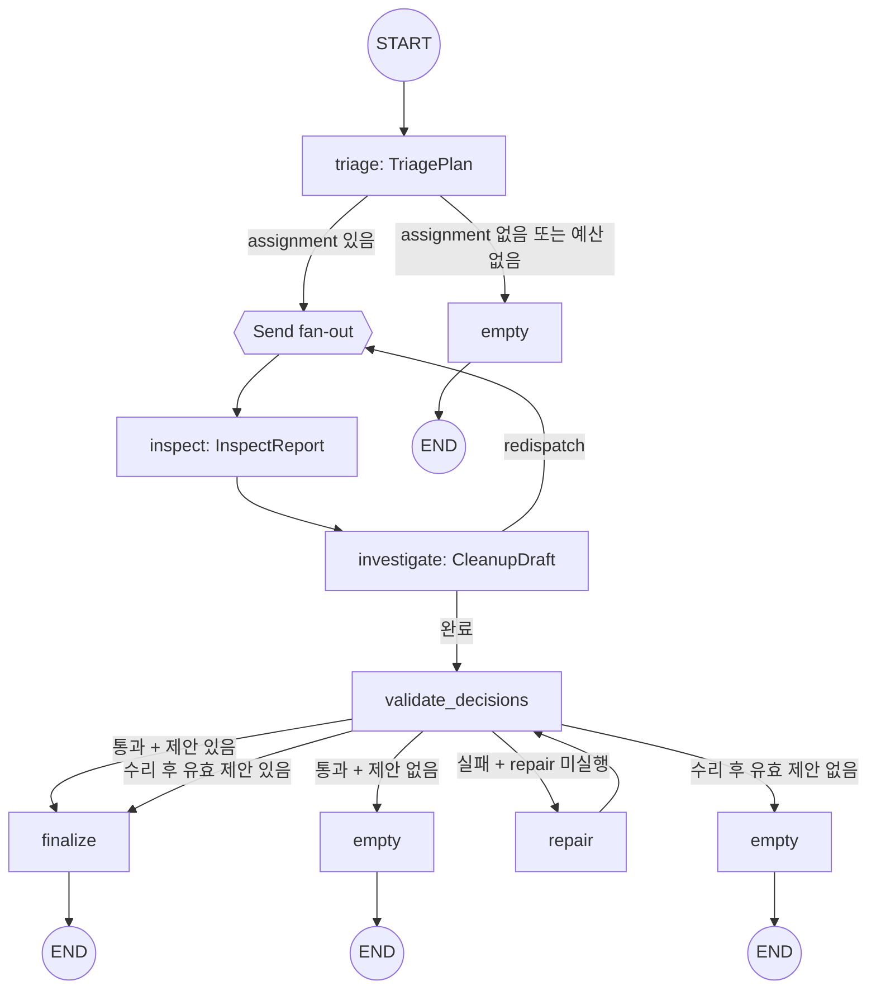
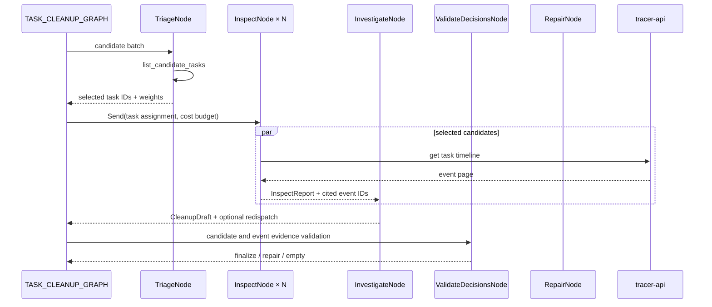
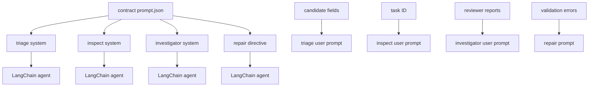
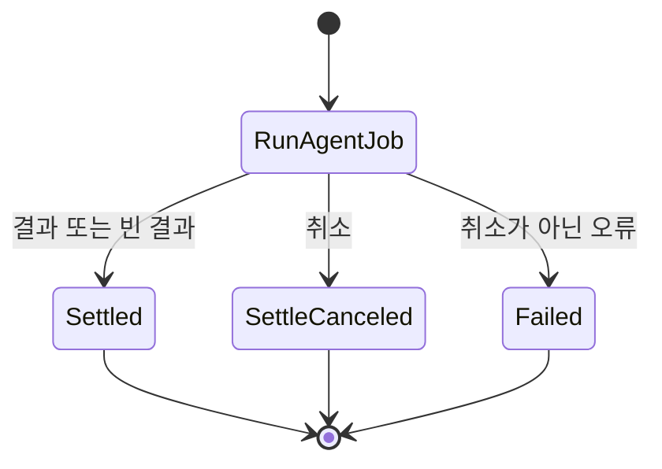

# Task Cleanup 에이전트

Task Cleanup 에이전트는 서버가 결정론적으로 선별한 정리 후보를 검토하고 archive 제안을 생성한다. `triage`가 후보를 노출하고, `inspect`가 후보별 event를 병렬 조사하며, `investigate`가 제안을 작성한다. 제안은 사용자의 검토와 승인 대상이며 task를 직접 변경하지 않는다.

## 토폴로지와 워크플로





`TriageNode`는 `list_candidate_tasks`만 사용한다. `InspectNode`는 할당된 task 하나의 event만 읽고, 조율자는 `COORDINATOR_TOOL_NAMES=()`로 도구 없이 보고를 종합한다. event가 있는 후보는 조사된 event를 인용해야 하며, event가 없는 후보는 event 인용 없이 archive 제안이 가능하다.

## 노드와 이동

| 노드 | 입력 | 처리 | 갱신 또는 결과 |
| --- | --- | --- | --- |
| `triage` | `TaskCleanupState` | 서버 후보 배치를 조회하고 review 대상을 weight로 선택한다 | `plan`, 노출 후보, 후보 근거 |
| `inspect` | `InspectDispatch` | 후보 하나의 timeline을 읽고 archive 여부·사유·event ID를 보고한다 | `reports`, `event_ids_by_task` |
| `investigate` | `TaskCleanupState` | review 보고를 종합해 `CleanupDraft`를 만들고 필요하면 redispatch한다 | `suggestions`, `redispatch` |
| `validate_decisions` | `TaskCleanupState` | 노출 후보와 조사 event만 제안이 인용하는지 검사한다 | 유효 제안, `validation_errors` |
| `repair` | `TaskCleanupState` | 검증 오류를 포함해 조율자 출력을 한 번 다시 생성한다 | 제안과 보고 갱신 |
| `finalize` | `TaskCleanupState` | 제안을 `max_suggestions`까지 외부 결과로 직렬화한다 | `suggestions` |
| `empty` | `TaskCleanupState` | 제안이 없거나 검증이 소진된 결과를 반환한다 | 빈 `suggestions` |

서버 후보 선별은 `qualify_candidates`가 담당한다. 최근 활동, running/waiting 상태의 stale 여부, event 유무, 중복 제목, placeholder 제목을 결정론적으로 평가하며 active child가 있는 task는 제외한다.

## 도구 타입

| 도구 | 노드 | 주요 인자 | 역할 |
| --- | --- | --- | --- |
| `list_candidate_tasks` | `triage` | `limit`, `cursor` | 서버가 자격을 계산한 후보 배치를 페이지로 노출한다 |
| `get_task_events` | `inspect` | `taskId`, `limit`, `cursor`, `order` | 후보 task의 event 페이지를 조회하고 event ID를 장부에 기록한다 |

후보 페이지에 노출된 task만 조율자가 제안할 수 있다. `ToolRegistry`는 Pydantic 모델로 인자를 검증하고 후보 노출·event citation 장부를 갱신한다. 전송 오류만 재시도 대상으로 분류하고 HTTP 도메인 오류는 재시도하지 않는다.

## 프롬프트 구성

| 프롬프트 | 계약 template | 실행 단계 |
| --- | --- | --- |
| investigator system | `task-cleanup.investigator.system` | review report 종합·archive suggestion |
| triage system | `task-cleanup.triage.system` | 후보 선택·weight 배분 |
| inspect system | `task-cleanup.inspect.system` | 단일 후보 event 검토 |
| repair directive | `task-cleanup.investigator.repair` | 검증 오류 수리 |



아래 원문은 `task_cleanup/prompts.py`와 계약 fragment를 결합한 prompt이다.

### Triage·inspect·repair prompt 원문과 번역

실행별 user prompt는 `Scan time`, 최대 archive task 수, `Output language`, reviewer reports를 추가한다. 관련 구현은 [graph.py](graph.py), [nodes](nodes/), [langchain_agent.py](langchain_agent.py), [tools/registry.py](tools/registry.py), [prompts.py](prompts.py), [policy.py](policy.py)에 있다.

프롬프트 전문은 문서가 옮겨 적지 않는다. 슬롯의 본문은 계약이, 슬롯을 감싸는 scaffold 는
`prompts.py` 가 소유한다. 두 축이 같은 template 을 읽으므로 그 본문을 문서 두 벌로 두면
계약이 바뀔 때 함께 낡는다.

```
계약   contract/agent/task-cleanup/prompt.json
task-cleanup.investigator.system
task-cleanup.investigator.repair
task-cleanup.triage.system
task-cleanup.inspect.system
```

## 미들웨어와 출력 타입

`build_cleanup_agent`는 prompt cache, model call limit, standardization, tool retry, 선택적 fallback을 사용한다. context editing과 같은 model retry middleware는 사용하지 않는다. 구조화 출력은 `TriagePlan`, `InspectReport`, `CleanupDraft`이며, `validate_suggestions`가 후보 ID·중복·event citation·제안 상한을 결정적으로 검증한다.

## Temporal 워크플로

세 잡 종류를 `agentJobWorkflow` 하나가 받는다. 준비와 종결을 별도 액티비티로 두지 않고
`runAgentJob` 실행 액티비티 안에서 처리하며 그 하나를 `generate` 큐로 보낸다. 잡 종류마다
워크플로를 두는 TypeScript 구현과 갈라진 자리이며 `divergence.json`의 `job.workflow.shape`가
그것을 갖는다.

| 액티비티 | 큐 | start-to-close | 재시도 | 비고 |
| --- | --- | --- | ---: | --- |
| `runAgentJob` | `generate` | 900초 | 3 | 30초 heartbeat. 실행 체인 전체가 이 안에서 돈다 |
| `settleCanceledAgentJob` | `jobs` | 30초 | — | 취소된 잡의 원장을 접는다 |



**재시도 경계가 실행 체인 전체를 감싼다.** 노드 하나가 실패해도 그래프가 처음부터 다시 돌므로
선언한 예산의 3배를 소진할 수 있다. 종착지는 노드마다 액티비티 하나이며 `divergence.json`의
같은 항목이 그 두 단계 수렴을 적는다.

## 관련 코드

| 확인 대상 | 파일 |
| --- | --- |
| 그래프 정의 | `graph.py` |
| 요청별 실행 조립 | `agent.py` |
| 선별·검사·결정 노드 | `nodes/inspect.py`, `nodes/decision.py`, `nodes/result.py` |
| LangChain agent와 미들웨어 | `langchain_agent.py` |
| 도구 registry | `tools/registry.py` |
| 프롬프트 조립 | `prompts.py` |
| 예산·팬아웃 정책 | `policy.py` |
| 추적 API 읽기 | `reader.py` |
| 워크플로와 액티비티 | `worker/workflows/jobs_workflows.py`, `jobs_activities.py` |
