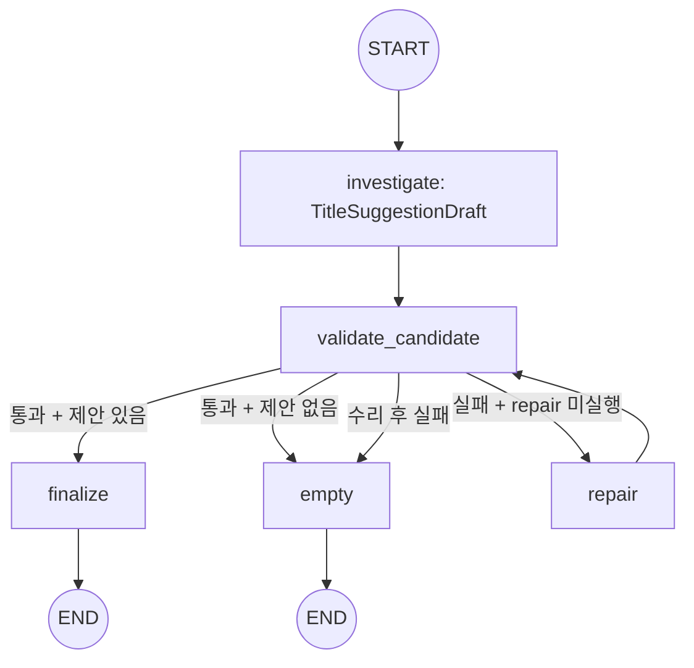
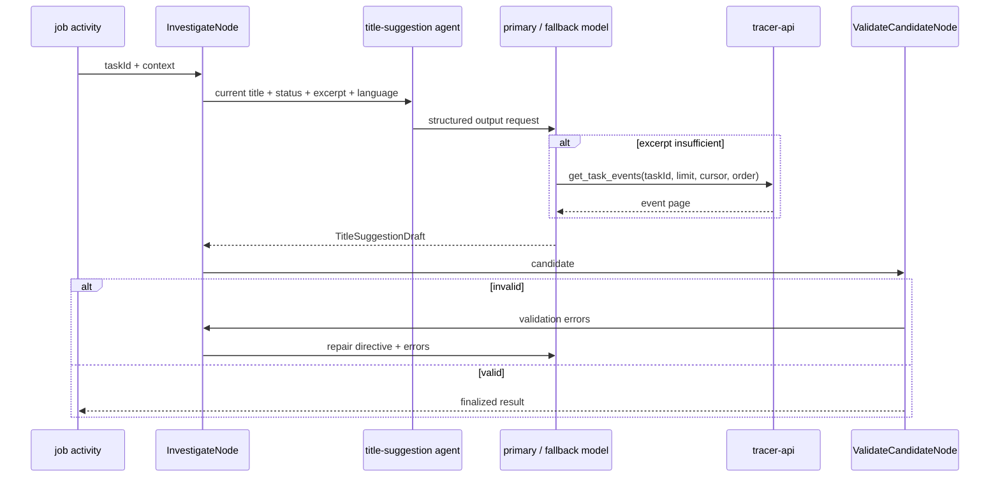
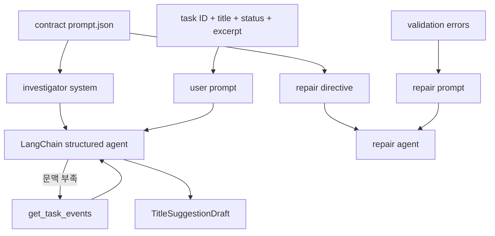
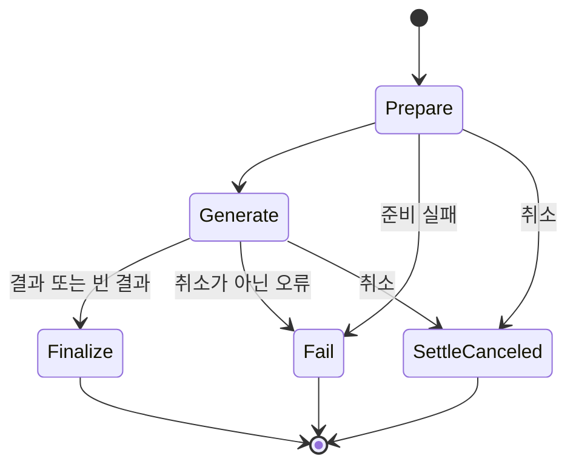

# Title Suggestion 에이전트

Title Suggestion 에이전트는 기록된 task의 현재 title과 대화 발췌를 분석해 대체 title을 제안한다. 발췌만으로 충분하면 도구를 사용하지 않고, 문맥이 부족하거나 절단되었을 때만 `get_task_events`를 조회한다. 출력은 구조화 결과와 결정적 검증을 통과해야 반환된다.

## 토폴로지와 워크플로





대화 발췌는 `windowed_turns`에서 최초 turn과 최근 창으로 축약된다. `normalize_title_candidate`가 현재 title 반복과 placeholder와 중복처럼 기계적으로 지울 수 있는 후보를 먼저 떨어뜨리고, 남은 수가 모자랄 때만 사유를 남겨 `repair`가 한 번 실행된다. repair 후에도 유효하지 않으면 빈 제안 목록으로 종료한다.

## 노드와 이동

| 노드 | 입력 | 처리 | 갱신 또는 결과 |
| --- | --- | --- | --- |
| `investigate` | `TitleSuggestionState` | 현재 title과 대화 문맥을 분석하고 필요할 때 event를 조회한다 | `candidate`, `messages`, 비용 |
| `validate_candidate` | `TitleSuggestionState` | 지울 수 있는 후보를 떨어뜨리고 모자란 수만 사유로 남긴다 | `candidate`, `validation_errors` |
| `repair` | `TitleSuggestionState` | 검증 오류를 포함해 title 후보를 1회 다시 생성한다 | `candidate`, `repair_attempted` |
| `finalize` | `TitleSuggestionState` | `TitleSuggestionDraft`를 외부 결과로 직렬화한다 | 제안 목록 |
| `empty` | `TitleSuggestionState` | 현재 title이 충분하거나 검증이 소진된 결과를 반환한다 | 빈 `suggestions` |

예약을 받는 노드는 `repair` 하나다. `investigate`는 리스를 받지 않고 실행의 잔량으로 돌므로 조사가 잔량을 다 써도 수리는 예약한 턴으로 실행된다.

유효한 출력은 빈 목록 또는 2~3개 제안이다. 각 제안은 현재 title과 달라야 하고, 정규화 후 서로 중복되지 않아야 하며 `untitled`, `test`, `task-123`과 같은 placeholder가 아니어야 한다.

`result_of`는 직렬화한 산출을 계약의 `agent/shared/redaction.json` `stages.output` 자리로 통과시킨다.
그 한 벌이 잡 원장과 조회 표면으로 함께 나가므로 가림도 그 자리 하나에 선다.

## 도구 타입

| 도구 | 주요 인자 | 역할 |
| --- | --- | --- |
| `get_task_events` | `taskId`, `limit`, `cursor`, `order` | 대화 발췌로 부족한 task event를 사용자 범위로 조회한다 |

도구는 `TitleLedgerReader`를 통해 tracer API의 task timeline을 호출한다. 기본 순서는 `asc`이며 모델은 `limit`과 `cursor`를 조절할 수 있다. 도구 결과는 모델의 구조화 출력 문맥으로 사용하고 별도 provenance 장부에는 누적하지 않는다.

## 프롬프트 구성

| 프롬프트 | 계약 template | 실행 단계 |
| --- | --- | --- |
| investigator system | `title-suggestion.investigator.system` | 문맥 분석·event 조회·title 생성 |
| repair directive | `title-suggestion.investigator.repair` | 결정적 검증 오류 수리 |



실행별 user prompt에는 `Task ID`, `Current title`, `Status`, 선택적 `Workspace`, `Output language`, event·turn count, 절단 여부, 대화 turn이 포함된다. 관련 구현은 [graph.py](graph.py), [nodes/candidate.py](nodes/candidate.py), [tools/registry.py](tools/registry.py), [prompts.py](prompts.py), [policy.py](policy.py)에 있다.

프롬프트 전문은 문서가 옮겨 적지 않는다. 슬롯의 본문은 계약이, 슬롯을 감싸는 scaffold 는
`prompts.py` 가 소유한다. 두 축이 같은 template 을 읽으므로 그 본문을 문서 두 벌로 두면
계약이 바뀔 때 함께 낡는다.

```
계약   contract/agent/title-suggestion/prompt.json
title-suggestion.investigator.system
title-suggestion.investigator.repair
```

## 미들웨어와 출력 타입

`AgentMiddlewareStack`이 네 에이전트가 함께 쓰는 순서로 층을 세우고, 구조화 출력을 요구하는 잡이라 산출 복구와 도구 실패 되돌림을 함께 받는다. `get_task_events`가 선언한 일시 오류는 tool retry가 다시 부르고, 재시도가 소진된 실패는 계약의 실패 문구를 담은 도구 결과가 되어 모델에게 돌아간다. 모델 출력은 `ToolStrategy(TitleSuggestionDraft, handle_errors=True)`로 구조화하고 `validate_candidate`가 title 규칙을 결정적으로 검사한다.

## Temporal 워크플로

세 잡 종류를 `agentJobWorkflow` 하나가 받고 준비 → 생성 → 종결 순서로 실행한다. 모델을 부르는
생성만 `generate` 큐로 보내고 나머지 단계는 `jobs` 큐에 남는다. 단계별 큐와 시간 상한과 재시도
상한은 계약의 `workflow/queues.yaml`이 소유한다.

| 액티비티 | 큐 | start-to-close | 재시도 | 비고 |
| --- | --- | --- | ---: | --- |
| `prepareAgentJob` | `jobs` | 60초 | 5 | 도메인 문맥을 모으고 원장을 실행 중으로 옮긴다 |
| `generateAgentJob` | `generate` | 300초 | 3 | 20분 schedule-to-close, 30초 heartbeat |
| `finalizeAgentJob` | `jobs` | 60초 | 5 | 원장 종결과 산출물과 완료 배달 |
| `failAgentJob` | `jobs` | 60초 | 5 | 어느 단계가 실패하든 원장을 실패로 닫는다 |
| `settleCanceledAgentJob` | `jobs` | 30초 | — | 액티비티가 돌기 전에 닿은 취소를 접는다 |



**자격은 생성 액티비티 밖으로 나가지 않는다.** 준비는 도메인 문맥만 모으고 그 산출이 워크플로
이력에 남는다. 이 시도가 쓸 봉투는 생성이 실행 직전에 받으며 종결은 자격을 뺀 정산 값만 받는다.

**생성이 다시 시도돼도 끝난 노드를 다시 태우지 않는다.** 그래프가 잡 하나를 열쇠로 삼는
LangGraph 체크포인트에서 이어가므로 실패 지점부터 재개한다. 그 상태는 계약이 소유하지 않는
`agent_langgraph` 스키마에 있으며 `divergence.json`의 `job.workflow.shape`가 그 자리를 갖는다.

## 관련 코드

| 확인 대상 | 파일 |
| --- | --- |
| 그래프 정의 | `graph.py` |
| 요청별 실행 조립 | `agent.py` |
| 조사·검증 노드 | `nodes/candidate.py` |
| LangChain agent와 미들웨어 | `runtime/llm/middleware_stack.py`, `runtime/llm/structured_agent.py` |
| 모델 호출자 조립 | `deps.py` |
| 도구 registry | `tools/registry.py` |
| 프롬프트 조립 | `prompts.py` |
| 예산·상한 정책 | `policy.py` |
| 추적 API 읽기 | `reader.py` |
| 워크플로와 액티비티 | `worker/workflows/jobs_workflows.py`, `jobs_activities.py` |
