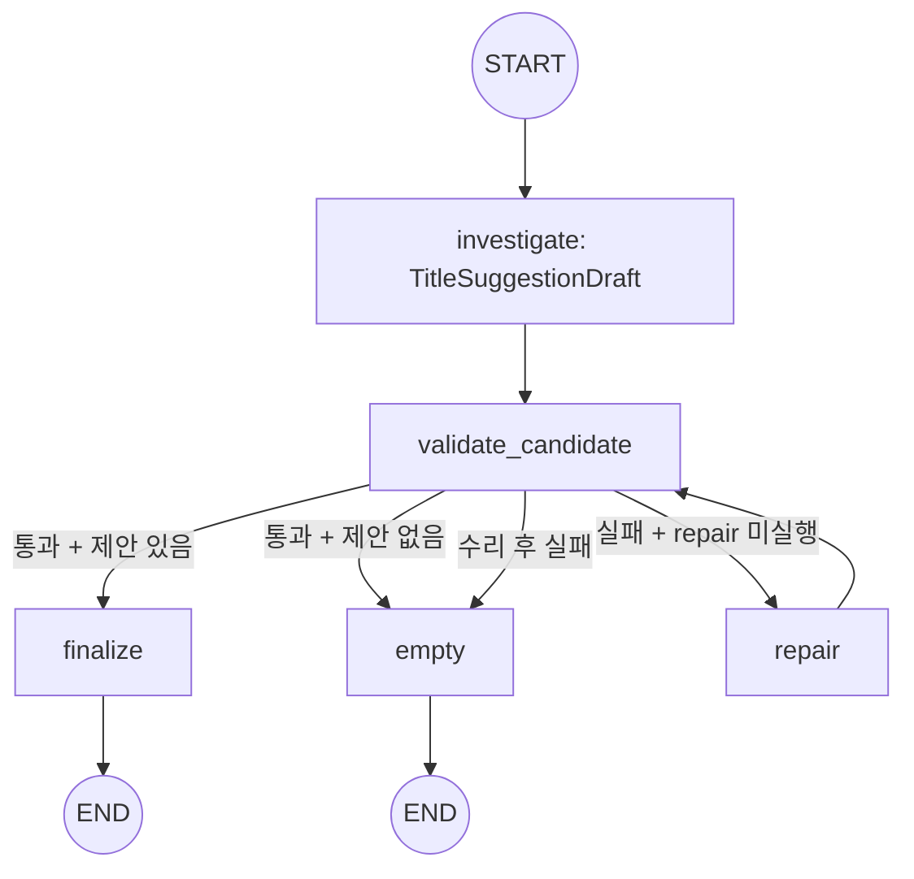
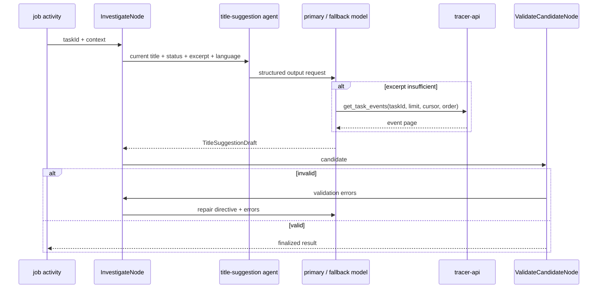
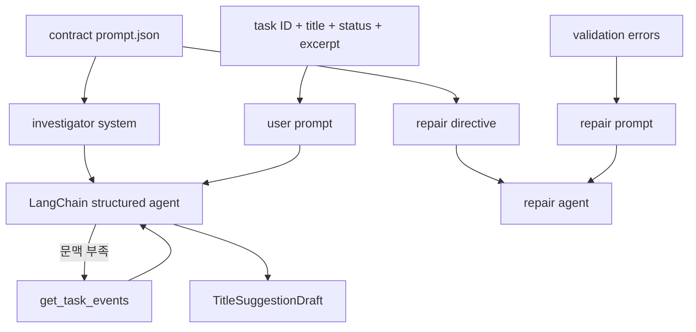
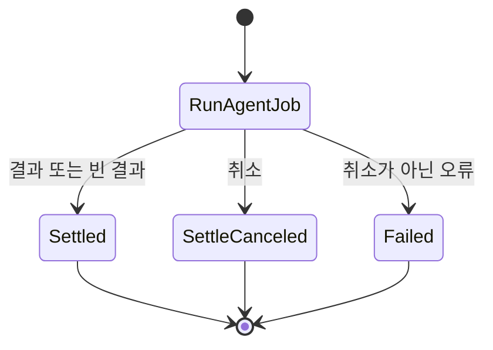

# Title Suggestion 에이전트

Title Suggestion 에이전트는 기록된 task의 현재 title과 대화 발췌를 분석해 대체 title을 제안한다. 발췌만으로 충분하면 도구를 사용하지 않고, 문맥이 부족하거나 절단되었을 때만 `get_task_events`를 조회한다. 출력은 구조화 결과와 결정적 검증을 통과해야 반환된다.

## 토폴로지와 워크플로





대화 발췌는 `windowed_turns`에서 최초 turn과 최근 창으로 축약된다. 현재 title 반복, placeholder, 중복, 제안 개수 오류가 있으면 결정적 검증이 실패하고 `repair`가 한 번 실행된다. repair 후에도 유효하지 않으면 빈 제안 목록으로 종료한다.

## 노드와 이동

| 노드 | 입력 | 처리 | 갱신 또는 결과 |
| --- | --- | --- | --- |
| `investigate` | `TitleSuggestionState` | 현재 title과 대화 문맥을 분석하고 필요할 때 event를 조회한다 | `candidate`, `messages`, 비용 |
| `validate_candidate` | `TitleSuggestionState` | 제안 수·현재 title 반복·중복·placeholder를 검사한다 | `validation_errors` |
| `repair` | `TitleSuggestionState` | 검증 오류를 포함해 title 후보를 한 번 다시 생성한다 | `candidate`, `repair_attempted` |
| `finalize` | `TitleSuggestionState` | `TitleSuggestionDraft`를 외부 결과로 직렬화한다 | 제안 목록 |
| `empty` | `TitleSuggestionState` | 현재 title이 충분하거나 검증이 소진된 결과를 반환한다 | 빈 `suggestions` |

유효한 출력은 빈 목록 또는 2~3개 제안이다. 각 제안은 현재 title과 달라야 하고, 정규화 후 서로 중복되지 않아야 하며 `untitled`, `test`, `task-123`과 같은 placeholder가 아니어야 한다.

## 도구 타입

| 도구 | 주요 인자 | 역할 |
| --- | --- | --- |
| `get_task_events` | `taskId`, `limit`, `cursor`, `order` | 대화 발췌로 부족한 task event를 사용자 범위로 조회한다 |

도구는 `TitleLedgerReader`를 통해 tracer API의 task timeline을 호출한다. 기본 순서는 `asc`이며 모델은 `limit`과 `cursor`를 조절할 수 있다. 도구 결과는 모델의 구조화 출력 문맥으로 사용하고 별도 provenance 장부에는 누적하지 않는다.

## 프롬프트 구성

| 프롬프트 | 계약 template | 실행 단계 |
| --- | --- | --- |
| investigator system | `title-suggestion.investigator.system` | 문맥 분석·event 조회·title 생성 |
| repair directive | `title-suggestion.investigator.repair` | 결정적 검증 오류 수리 |



실행별 user prompt에는 `Task ID`, `Current title`, `Status`, 선택적 `Workspace`, `Output language`, event·turn count, 절단 여부, 대화 turn이 포함된다. 관련 구현은 [graph.py](graph.py), [nodes/candidate.py](nodes/candidate.py), [langchain_agent.py](langchain_agent.py), [tools/registry.py](tools/registry.py), [prompts.py](prompts.py), [policy.py](policy.py)에 있다.

프롬프트 전문은 문서가 옮겨 적지 않는다. 슬롯의 본문은 계약이, 슬롯을 감싸는 scaffold 는
`prompts.py` 가 소유한다. 두 축이 같은 template 을 읽으므로 그 본문을 문서 두 벌로 두면
계약이 바뀔 때 함께 낡는다.

```
계약   contract/agent/title-suggestion/prompt.json
title-suggestion.investigator.system
title-suggestion.investigator.repair
```

## 미들웨어와 출력 타입

`build_title_agent`는 prompt cache, model call limit, standardization, 선택적 fallback을 사용한다. tool retry, context editing, same-model retry는 사용하지 않는다. 모델 출력은 `ToolStrategy(TitleSuggestionDraft, handle_errors=True)`로 구조화하고 `validate_candidate`가 title 규칙을 결정적으로 검사한다.

## Temporal 워크플로

세 잡 종류를 `agentJobWorkflow` 하나가 받는다. 준비와 종결을 별도 액티비티로 두지 않고
`runAgentJob` 실행 액티비티 안에서 처리하며 그 하나를 `generate` 큐로 보낸다. 잡 종류마다
워크플로를 두는 TypeScript 구현과 갈라진 자리이며 `divergence.json`의 `job.workflow.shape`가
그것을 갖는다.

| 액티비티 | 큐 | start-to-close | 재시도 | 비고 |
| --- | --- | --- | ---: | --- |
| `runAgentJob` | `generate` | 900초 | 3 | 30초 heartbeat. 실행 체인 전체가 이 안에서 돈다 |
| `settleCanceledAgentJob` | `jobs` | 30초 | — | 취소된 잡의 원장을 접는다 |



**재시도 경계가 실행 체인 전체를 감싼다.** 노드 하나가 실패해도 그래프가 처음부터 다시 돌므로
선언한 예산의 3배를 소진할 수 있다. 종착지는 노드마다 액티비티 하나이며 `divergence.json`의
같은 항목이 그 두 단계 수렴을 적는다.

## 관련 코드

| 확인 대상 | 파일 |
| --- | --- |
| 그래프 정의 | `graph.py` |
| 요청별 실행 조립 | `agent.py` |
| 조사·검증 노드 | `nodes/candidate.py` |
| LangChain agent와 미들웨어 | `langchain_agent.py` |
| 도구 registry | `tools/registry.py` |
| 프롬프트 조립 | `prompts.py` |
| 예산·상한 정책 | `policy.py` |
| 추적 API 읽기 | `reader.py` |
| 워크플로와 액티비티 | `worker/workflows/jobs_workflows.py`, `jobs_activities.py` |
